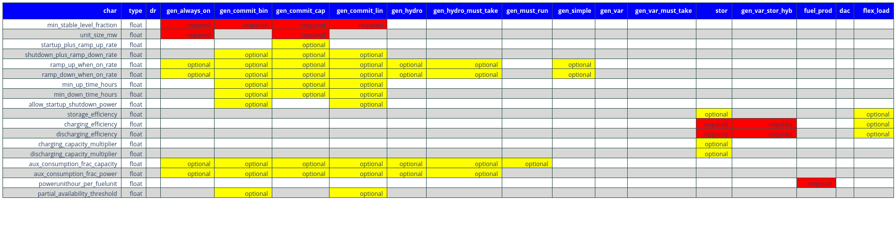

########
Database
########

This chapter describes the following:

* :ref:`database-structure-section-ref` : the structure of the database and its
  associated tables
* :ref:`building-the-database-section-ref` : instructions on how to build the
  database
* :ref:`database-testing-section-ref` : instructions on how to validate the
  database inputs

Database Structure
##################

.. _database-section-ref:

.. automodule:: db

.. _building-the-database-section-ref:

Building the Database
#####################

*********************
Creating the Database
*********************

.. automodule:: db.create_database

***********************
Populating the Database
***********************

.. automodule:: db.port_csvs_to_db

Temporal Inputs
***************

.. automodule:: db.csvs_test_examples.doc

----------------
Load Zone Inputs
----------------

**Relevant tables:**

+-------------------------------+----------------------------------------------+
|:code:`scenarios` table column |:code:`load_zone_scenario_id`                 |
+-------------------------------+----------------------------------------------+
|:code:`scenario` table feature |N/A                                           |
+-------------------------------+----------------------------------------------+
|:code:`subscenario_` table     |:code:`subscenarios_geography_load_zones`     |
+-------------------------------+----------------------------------------------+
|:code:`input_` tables          |:code:`inputs_geography_load_zones`           |
+-------------------------------+----------------------------------------------+

The :code:`subscenarios_geography_load_zones` contains the IDs, names, and
descriptions of the load zone scenarios to be available to the user. This
table must be populated before data for the respective
:code:`load_zone_scenario_id` can be imported into the input table.

The user must decide the load zones will be, i.e. what is the unit at which
load is met. There are some parameters associated with each load zone,
e.g. unserved-energy and overgeneration penalties. The relevant database
table is :code:`inputs_geography_load_zones` where the user must list the
load zones along with whether unserved energy and overgeneration should be
allowed in the load zone, and what the violation penalties would be. If a
user wanted to create a different 'geography,' e.g. combine load zones, add
a load zone, remove one, have a completely different set of load zones, etc.,
they would need to create a new :code:`load_zone_scenario_id` and list the
load zones. If a user wanted to keep the same load zones, but change the
unserved energy or overgeneration penalties, they would also need to create
a new :code:`load_zone_scenario_id`.

Separately, each generator to be included in a scenario must be assigned a
load zone to whose load-balance constraint it can contribute
(see :ref:`project-geography-section-ref`).

GridPath also includes other geographic layers, including those for
operating reserves, reliability reserves, and policy requirements.

A scenario's load zone geographic setup is selected via the
:code:`load_zone_scenario_id` column of the :code:`scenarios` table.

-----------
System Load
-----------

**Relevant tables:**

+-------------------------------+---------------------------------+
|:code:`scenarios` table column |:code:`load_scenario_id`         |
+-------------------------------+---------------------------------+
|:code:`scenario` table feature |N/A                              |
+-------------------------------+---------------------------------+
|:code:`subscenario_` table     |:code:`subscenarios_system_load` |
+-------------------------------+---------------------------------+
|:code:`input_` tables          |:code:`inputs_system_load`       |
+-------------------------------+---------------------------------+

The load for each load zone must be specified the :code:`inputs_system_load`
table under a :code:`load_scenario_id` key. If the load for one load zone
changes but not for others, all must be included again under a different
:code:`load_scenario_id`. The :code:`inputs_system_load` table can contain
data for timepoints not included in a scenario. GridPath will only select
the load for the relevant timepoints based on the
:code:`temporal_scenario_id` selected by the user in the :code:`scenarios`
table.

--------------
Project Inputs
--------------

Generator and storage resources in GridPath are called *projects*. Each
project can be assigned different characteristics depending on the scenario,
whether its geographic location, ability to contribute to reserve or policy
requirements, its capacity and operating characteristics. You can optionally
import all projects that may be part of a scenario in the
:code:`inputs_project_all` table of the GridPath database.

.. _project-geography-section-ref:

-----------------
Project Geography
-----------------

**Relevant tables:**

+-------------------------------+----------------------------------------+
|:code:`scenarios` table column |:code:`project_load_zone_scenario_id`   |
+-------------------------------+----------------------------------------+
|:code:`scenario` table feature |N/A                                     |
+-------------------------------+----------------------------------------+
|:code:`subscenario_` table     |:code:`subscenarios_project_load_zones` |
+-------------------------------+----------------------------------------+
|:code:`input_` tables          |:code:`inputs_project_load_zones`       |
+-------------------------------+----------------------------------------+

Each *project* in a GridPath scenario must be assigned a load zone to whose
load-balance constraint it will contribute. In the
:code:`inputs_project_load_zones`, each
:code:`project_load_zone_scenario_id` should list all projects with their load
zones. For example, if a user initially had three load zones and assigned
one of them to each project, then decided to combine two of those load
zones into one, they would need to create a new
:code:`project_load_zone_scenario_id` that includes all projects from the
two combined zones with the new zone assigned to them as well as all
projects from the zone that was not modified. This
:code:`inputs_project_load_zones` table can include more projects that are
modeled in a scenario, as GridPath will select only the subset of projects
from the scenario's project portfolio (see
:ref:`project-portfolio-section-ref`).

.. _project-portfolio-section-ref:

-----------------
Project Portfolio
-----------------

**Relevant tables:**

+--------------------------------+----------------------------------------------+
|:code:`scenarios` table column  |:code:`project_portfolio_scenario_id`         |
+--------------------------------+----------------------------------------------+
|:code:`scenarios` table feature |N/A                                           |
+--------------------------------+----------------------------------------------+
|:code:`subscenario_` table      |:code:`subscenarios_project_portfolios`       |
+--------------------------------+----------------------------------------------+
|:code:`input_` tables           |:code:`inputs_project_portfolios`             |
+--------------------------------+----------------------------------------------+

A scenario's 'project portfolio' determines which projects to include in a
scenario and how to treat each project’s capacity, e.g. is the capacity
going to be available to the optimization as 'given' (specified), will there
be decision variables associated with building capacity at this project, will
the optimization have the option to retire the project, etc. In GridPath,
this is called the project's *capacity_type* (see
:ref:`project-capacity-type-section-ref`). You can view all implemented
capacity types in the :code:`mod_capacity_types` table of the database.

The relevant database table is for the projet
portfolio data is :code:`inputs_project_portfolios`. The primary key of this
table is the :code:`project_portfolio_scenario_id` and the name of the
project. A new :code:`project_portfolio_scenario_id` is needed if the user
wants to select a different list of projects to be included in a scenario or
if she wants to keep the same list of projects but change a project’s capacity
type. In the latter case, all projects that don’t require a 'capacity type'
change would also have to be listed again in the database under the new
:code:`project_portfolio_scenario_id`. All
:code:`project_portfolio_scenario_id`'s along with their names and
descriptions must first be listed in the
:code:`subscenarios_project_portfolios` table.

------------------
Specified Projects
------------------

.. _specified-project-capacity-section-ref:

Capacity
--------

**Relevant tables:**

+--------------------------------+------------------------------------------------+
|:code:`scenarios` table column  |:code:`project_specified_capacity_scenario_id`  |
+--------------------------------+------------------------------------------------+
|:code:`scenarios` table feature |N/A                                             |
+--------------------------------+------------------------------------------------+
|:code:`subscenario_` table      |:code:`subscenarios_project_specified_capacity` |
+--------------------------------+------------------------------------------------+
|:code:`input_` tables           |:code:`inputs_project_specified_capacity`       |
+--------------------------------+------------------------------------------------+

If the project portfolio includes project of the capacity types
:code:`gen_spec`, :code:`gen_ret_bin`, :code:`gen_ret_lin`, or
:code:`stor_spec`, the user must select that amount of project capacity that
the optimization should see as given (i.e. specified) in every period as
well as the associated fixed O&M costs (see
:ref:`specified-project-fixed-cost-section-ref`). Project
capacities are in the :code:`inputs_project_specified_capacity` table. For
:code:`gen_` capacity types, this table contains the project's power rating
and for :code:`stor_spec` it also contains the storage project's energy rating.

The primary key of this table includes the
:code:`project_specified_capacity_scenario_id`, the project name, and the
period. Note that this table can include projects that are not in the
user’s portfolio: the utilities that pull the scenario data look at the
scenario’s portfolio, pull the projects with the “specified” capacity types
from that, and then get the capacity for only those projects (and for the
periods selected based on the scenario's temporal setting). A new
:code:`project_specified_capacity_scenario_id` would be needed if a user wanted
to change the available capacity of even only a single project in a single
period (and all other project-year-capacity data points would need to be
re-inserted in the table under the new
:code:`project_specified_capacity_scenario_id`).

.. _specified-project-fixed-cost-section-ref:

Fixed Costs
-----------

**Relevant tables:**

+--------------------------------+--------------------------------------------------+
|:code:`scenarios` table column  |:code:`project_specified_fixed_cost_scenario_id`  |
+--------------------------------+--------------------------------------------------+
|:code:`scenarios` table feature |N/A                                               |
+--------------------------------+--------------------------------------------------+
|:code:`subscenario_` table      |:code:`subscenarios_project_specified_fixed_cost` |
+--------------------------------+--------------------------------------------------+
|:code:`input_` tables           |:code:`inputs_project_specified_fixed_cost`       |
+--------------------------------+--------------------------------------------------+

If the project portfolio includes project of the capacity types
:code:`gen_spec`, :code:`gen_ret_bin`, :code:`gen_ret_lin`, or
:code:`stor_spec`, the user must select the fixed O&M costs associated with
the specified project capacity in every period. These can be varied by
scenario via the :code:`project_specified_fixed_cost_scenario_id` subscenario.

The treatment for specified project fixed cost inputs is similar to that for
their capacity (see :ref:`specified-project-capacity-section-ref`).

============
New Projects
============

Capital Costs
=============

**Relevant tables:**

+--------------------------------+----------------------------------------------+
|:code:`scenarios` table column  |:code:`project_new_cost_scenario_id`          |
+--------------------------------+----------------------------------------------+
|:code:`scenarios` table feature |N/A                                           |
+--------------------------------+----------------------------------------------+
|:code:`subscenario_` table      |:code:`subscenarios_project_new_cost`         |
+--------------------------------+----------------------------------------------+
|:code:`input_` tables           |:code:`inputs_project_new_cost`               |
+--------------------------------+----------------------------------------------+

If the project portfolio includes projects of a 'new' capacity type
(:code:`gen_new_bin`, :code:`gen_new_lin`, :code:`stor_new_bin`, or
:code:`stor_new_lin`), the user must specify the cost for building a project
in each period and, optionally, any minimum and maximum requirements on the
total capacity to be build (see :ref:`new-project-potential-section-ref`).
Similarly to the specified-project tables, the primary key is the
combination of :code:`project_new_cost_scenario_id`, project, and period, so if
the user wanted the change the cost of just a single project for a single
period, all other project-period combinations would have to be re-inserted in
the database along with the new project_new_cost_scenario_id. Also note that
the :code:`inputs_project_new_cost` table can include projects that are not
in a particular scenario’s portfolio and periods that are not in the
scenario's temporal setup: each :code:`capacity_type` module has utilities
that pull the scenario data and only look at the portfolio selected by the
user, pull the projects with the 'new' *capacity types* from that list, and
then get the cost for only those projects and for the periods selected in
the temporal settings.

Note that capital costs must be annualized outside of GridPath and input as
$/MW-yr in the :code:`inputs_project_new_cost` table. For storage projects,
GridPath also requires an annualized cost for the project's energy
component, so both a $/MW-yr capacity component cost and a $/MWh-yr energy
component cost is required, allowing GridPath to endogenously determine
storage sizing.

.. _new-project-potential-section-ref:

Potential
=========

**Relevant tables:**

+--------------------------------+----------------------------------------------+
|:code:`scenarios` table column  |:code:`project_new_potential_scenario_id`     |
+--------------------------------+----------------------------------------------+
|:code:`scenarios` table feature |N/A                                           |
+--------------------------------+----------------------------------------------+
|:code:`subscenario_` table      |:code:`subscenarios_project_new_potential`    |
+--------------------------------+----------------------------------------------+
|:code:`input_` tables           |:code:`inputs_project_new_potential`          |
+--------------------------------+----------------------------------------------+

If the project portfolio includes projects of a 'new' capacity type
(:code:`gen_new_bin`, :code:`gen_new_lin`, :code:`stor_new_bin`, or
:code:`stor_new_lin`), the user may specify the minimum and maximum
cumulative new capacity to be built in each period in the
:code:`inputs_project_new_potential` table. For storage project, the minimum
and maximum energy capacity may also be specified. All columns are optional
and NULL values are interpreted by GridPath as no constraint. Projects that
don't either a minimum or maximum cumulative new capacity constraints can be
omitted from this table completely.

====================
Project Availability
====================

**Relevant tables:**

+--------------------------------+----------------------------------------------+
|:code:`scenarios` table column  |:code:`project_availability_scenario_id`      |
+--------------------------------+----------------------------------------------+
|:code:`scenarios` table feature |N/A                                           |
+--------------------------------+----------------------------------------------+
|:code:`subscenario_` table      |:code:`subscenarios_project_availability`     |
+--------------------------------+----------------------------------------------+
|:code:`input_` tables           |:code:`inputs_project_availability`           |
+--------------------------------+----------------------------------------------+

All projects in a GridPath scenario must be a assigned an *availability
type*, which determines whether their capacity is operational in each
timepoint in which the capacity exists. All implemented availability types are
listed in the :code:`mod_availability_types` table.

Each project's availability type are given in the
:code:`inputs_project_availability`. The availability types currently
implemented include :code:`exogenous` (availability is determined outside of
a GridPath model via the data fed into it) and two endogenous types:
:code:`binary` and :code:`continuous` that require certain inputs that
determine how availability is constrained in the GridPath model. See the
:ref:`project-availability-type-section-ref` section for more info. In
addition to the project availability types, the
:code:`inputs_project_availability` table contains the information for
how to find any additional data needed to determine project availability with
the :code:`exogenous_availability_scenario_id` and
:code:`endogenous_availability_scenario` columns for the endogenous and
exogenous types respectively. The IDs in the former column are linked to the
data in the :code:`inputs_project_availability_exogenous` table and in the
latter column to the :code:`inputs_project_availability_endogenous` table.
For projects of the :code:`exogenous` availability type, if the value is in the
:code:`exogenous_availability_scenario_id` column is NULL, no availability
capacity derate is applied by GridPath. For projects of a :code:`binary` of
:code:`continuous` availability type, a value in the
:code:`endogenous_availability_scenario_id` is required.

Exogenous
=========

**Relevant tables:**

+---------------------------+----------------------------------------------------+
|:code:`subscenario_` table |:code:`subscenarios_project_availability_exogenous` |
+---------------------------+----------------------------------------------------+
|:code:`input_` table       |:code:`inputs_project_availability_exogenous`       |
+---------------------------+----------------------------------------------------+

Within each :code:`project_availability_scenario_id`, a project of the
:code:`exogenous` *availability type* can point to a particular
:code:`exogenous_availability_scenario_id`, the data for which is contained
in the :code:`inputs_project_availability_exogenous` table. The names and
descriptions of each :code:`project` and
:code:`exogenous_availability_scenario_id` combination are in the
:code:`subscenarios_project_availability_exogenous` table. The availability
derate for each combination is defined by stage and timepoint, and must be
between 0 (full derate) and 1 (no derate).

Endogenous
==========

**Relevant tables:**

+---------------------------+-----------------------------------------------------+
|:code:`subscenario_` table |:code:`subscenarios_project_availability_endogenous` |
+---------------------------+-----------------------------------------------------+
|:code:`input_` table       |:code:`inputs_project_availability_endogenous`       |
+---------------------------+-----------------------------------------------------+

Within each :code:`project_availability_scenario_id`, a project of the
:code:`binary` or :code:`continuous` *availability type* must point to a
particular :code:`endogenous_availability_scenario_id`, the data for which
is contained in the :code:`inputs_project_availability_endogenous` table. The
names and descriptions of each :code:`project` and
:code:`endogenous_availability_scenario_id` combination are in the
:code:`subscenarios_project_availability_endogenous` table. For each
combination, the user must define to the total number of hours that a
project will be unavailable per period, the minimum and maximum length of
each unavailability event in hours, and the minimum and maximum number of
hours between unavailability events. Based on these inputs, GridPath determines
the exact availability schedule endogenously.

===================================
Project Operational Characteristics
===================================

**Relevant tables:**

+--------------------------------+-----------------------------------------------+
|:code:`scenarios` table column  |:code:`project_operational_chars_scenario_id`  |
+--------------------------------+-----------------------------------------------+
|:code:`scenarios` table feature |N/A                                            |
+--------------------------------+-----------------------------------------------+
|:code:`subscenario_` table      |:code:`subscenarios_project_operational_chars` |
+--------------------------------+-----------------------------------------------+
|:code:`input_` tables           |:code:`inputs_project_operational_chars`       |
+--------------------------------+-----------------------------------------------+

The user must decide how to model the operations of *projects*, e.g. is this
a fuel-based dispatchable (CCGT) or baseload project (nuclear), is it an
intermittent plant, is it a battery, etc. In GridPath, this is called the
project’s *operational type*. All implemented operational types are listed
in the :code:`mod_operational_types` table.

Each *operational type* has an associated set of characteristics, which must
be included in the :code:`inputs_project_operational_chars` table. The primary
key of this table is the :code:`project_operational_chars_scenario_id`,
which is also the column that determines project operational characteristics
for a scenario via the :code:`scenarios` table, and the project. If a
project’s operational type changes (e.g. the user decides to model a coal
plant as, say, :code:`gen_always_on` instead of :code:`gen_commit_bin`) or the
user wants to modify one of its operating characteristics (e.g. its minimum
loading level), then a new :code:`project_operational_chars_scenario_id` must
be created and all projects listed again, even if the rest of the projects'
operating types and characteristics do not change.

The ability to provide each type of reserve is currently an 'operating
characteristic' determined via the :code:`inputs_project_operational_chars`
table.

Not all operational types have all the characteristics in
the :code:`inputs_project_operational_chars`. GridPath's validation suite
does check whether certain required characteristic for an operational type are
populated and warns the user if some characteristics that have been filled
are actually not used by the respective operational type. See the matrix below
for the required and optional characteristics for each operational type.

Several types of operational characteristics vary by dimensions are other
than project, so they are input in separate tables and linked to the
:code:`inputs_project_operational_chars` via an ID column. These include
heat rates, variable generator profiles, and hydro characteristics.

Heat Rates (OPTIONAL)
=====================

**Relevant tables:**

+---------------------------+----------------------------------------------+
|key column                 |:code:`heat_rate_curves_scenario_id`          |
+---------------------------+----------------------------------------------+
|:code:`subscenario_` table |:code:`subscenarios_project_heat_rate_curves` |
+---------------------------+----------------------------------------------+
|:code:`input_` table       |:code:`inputs_project_heat_rate_curves`       |
+---------------------------+----------------------------------------------+

Fuel-based generators in GridPath require a heat-rate curve to be specified
for the project. Heat rate curves are modeled via piecewise linear
constraints and must be input in terms of an average heat rate for a load
point. These data are in the :code:`inputs_project_heat_rate_curves` for
each project that requires a heat rate, while the names and descriptions of
the heat rate curves each project can be assigned are in the
:code:`subscenarios_project_heat_rate_curves`. These two tables are linked
to each other and to the :code:`inputs_project_operational_chars` via the
:code:`heat_rate_curves_scenario_id` key column. The inputs table can contain
data for projects that are not included in a GridPath scenario, as the
relevant projects for a scenario will be pulled based on the scenario's
project portfolio subscenario.

Variable Generator Profiles (OPTIONAL)
======================================

**Relevant tables:**

+---------------------------+---------------------------------------------------------+
|key column                 |:code:`variable_generator_profile_scenario_id`           |
+---------------------------+---------------------------------------------------------+
|:code:`subscenario_` table |:code:`subscenarios_project_variable_generator_profiles` |
+---------------------------+---------------------------------------------------------+
|:code:`input_` table       |:code:`inputs_project_variable_generator_profiles`       |
+---------------------------+---------------------------------------------------------+

Variable generators in GridPath require a profile (power output as a fraction
of capacity) to be specified for the project for each *timepoint* in which
it can exist in a GridPath model. Profiles are in the
:code:`inputs_project_variable_generator_profiles`
for each variable project and timepoint, while the names and descriptions of
the profiles each project can be assigned are in the
:code:`subscenarios_project_variable_generator_profiles`. These two tables
are linked to each other and to the :code:`inputs_project_operational_chars`
via the :code:`variable_generator_profile_scenario_id` key column. The
:code:`inputs_project_variable_generator_profiles` table can contain data
for projects and timepoints that are not included in a particular GridPath
scenario: GridPath will select the subset of projects and timepoints based
on the scenarios project portfolio and temporal subscenarios.

Hydro Operational Characteristics (OPTIONAL)
============================================

**Relevant tables:**

+---------------------------+-----------------------------------------------------+
|key column                 |:code:`hydro_operational_chars_scenario_id`          |
+---------------------------+-----------------------------------------------------+
|:code:`subscenario_` table |:code:`subscenarios_project_hydro_operational_chars` |
+---------------------------+-----------------------------------------------------+
|:code:`input_` table       |:code:`inputs_project_hydro_operational_chars`       |
+---------------------------+-----------------------------------------------------+

Hydro generators in GridPath require that average power, minimum power, and
maximum power be specified for the project for each *balancing
type*/*horizon* in which it can exist in a GridPath model. These inputs are in
the :code:`inputs_project_hydro_operational_chars`
for each project, balancing type, and horizon, while the names and
descriptions of the characteristis each project can be assigned are in the
:code:`subscenarios_project_hydro_operational_chars`. These two tables
are linked to each other and to the :code:`inputs_project_operational_chars`
via the :code:`hydro_operational_chars_scenario_id` key column. The
:code:`inputs_project_hydro_operational_chars` table can contain data
for projects and horizons that are not included in a particular GridPath
scenario: GridPath will select the subset of projects and horizons based
on the scenarios project portfolio and temporal subscenarios.

Transmission Inputs (OPTIONAL)
******************************

Optional inputs needed if transmission feature is enabled for a scenario.

======================
Transmission Portfolio
======================

Relevant tables:

+--------------------------------+----------------------------------------------+
|:code:`scenarios` table column  |:code:`project_portfolio_scenario_id`         |
+--------------------------------+----------------------------------------------+
|:code:`scenarios` table feature |:code:`of_transmission`                       |
+--------------------------------+----------------------------------------------+
|:code:`subscenario_` table      |:code:`subscenarios_transmission_portfolios`  |
+--------------------------------+----------------------------------------------+
|:code:`input_` tables           |:code:`inputs_transmission_portfolios`        |
+--------------------------------+----------------------------------------------+

=======================
Transmission Topography
=======================

Relevant tables:

+--------------------------------+----------------------------------------------+
|:code:`scenarios` table column  |:code:`transmission_load_zones_scenario_id`   |
+--------------------------------+----------------------------------------------+
|:code:`scenarios` table feature |:code:`of_transmission`                       |
+--------------------------------+----------------------------------------------+
|:code:`subscenario_` table      |:code:`subscenarios_transmission_load_zones`  |
+--------------------------------+----------------------------------------------+
|:code:`input_` tables           |:code:`inputs_transmission_load_zones`        |
+--------------------------------+----------------------------------------------+

======================
Specified Transmission
======================

Capacity
========

Relevant tables:

+--------------------------------+----------------------------------------------------+
|:code:`scenarios` table column  |:code:`transmission_specified_capacity_scenario_id` |
+--------------------------------+----------------------------------------------------+
|:code:`scenarios` table feature |:code:`of_transmission`                             |
+--------------------------------+----------------------------------------------------+
|:code:`subscenario_` table      |:code:`subscenarios_transmission_specified_capacity`|
+--------------------------------+----------------------------------------------------+
|:code:`input_` tables           |:code:`inputs_transmission_specified_capacity`      |
+--------------------------------+----------------------------------------------------+

================
New Transmission
================

Capital Costs
=============

Relevant tables:

+--------------------------------+----------------------------------------------+
|:code:`scenarios` table column  |:code:`transmission_new_cost_scenario_id`     |
+--------------------------------+----------------------------------------------+
|:code:`scenarios` table feature |:code:`of_transmission`                       |
+--------------------------------+----------------------------------------------+
|:code:`subscenario_` table      |:code:`subscenarios_transmission_new_cost`    |
+--------------------------------+----------------------------------------------+
|:code:`input_` tables           |:code:`inputs_transmission_new_cost`          |
+--------------------------------+----------------------------------------------+

========================================
Transmission Operational Characteristics
========================================

+--------------------------------+----------------------------------------------------+
|:code:`scenarios` table column  |:code:`transmission_operational_chars_scenario_id`  |
+--------------------------------+----------------------------------------------------+
|:code:`scenarios` table feature |:code:`of_transmission`                             |
+--------------------------------+----------------------------------------------------+
|:code:`subscenario_` table      |:code:`subscenarios_transmission_operational_chars` |
+--------------------------------+----------------------------------------------------+
|:code:`input_` tables           |:code:`inputs_transmission_operational_chars`       |
+--------------------------------+----------------------------------------------------+

Fuel Inputs (OPTIONAL)
**********************

====================
Fuel Characteristics
====================

Relevant tables:

+--------------------------------+-----------------------------------+
|:code:`scenarios` table column  |:code:`fuel_scenario_id`           |
+--------------------------------+-----------------------------------+
|:code:`subscenario_` table      |:code:`subscenarios_project_fuels` |
+--------------------------------+-----------------------------------+
|:code:`input_` tables           |:code:`inputs_project_fuels`       |
+--------------------------------+-----------------------------------+

===========
Fuel Prices
===========

Relevant tables:

+--------------------------------+-----------------------------------------+
|:code:`scenarios` table column  |:code:`fuel_price_scenario_id`           |
+--------------------------------+-----------------------------------------+
|:code:`subscenario_` table      |:code:`subscenarios_project_fuel_prices` |
+--------------------------------+-----------------------------------------+
|:code:`input_` tables           |:code:`inputs_project_fuel_prices`       |
+--------------------------------+-----------------------------------------+

Reserves (OPTIONAL)
*******************

=============
Regulation Up
=============

Balancing Areas
===============

Relevant tables:

+-------------------------------+-------------------------------------------------+
|:code:`scenarios` table column |:code:`regulation_up_ba_scenario_id`             |
+-------------------------------+-------------------------------------------------+
|:code:`scenario` table feature |:code:`of_regulation_up`                         |
+-------------------------------+-------------------------------------------------+
|:code:`subscenario_` table     |:code:`subscenarios_geography_regulation_up_bas` |
+-------------------------------+-------------------------------------------------+
|:code:`input_` tables          |:code:`inputs_geography_regulation_up_bas`       |
+-------------------------------+-------------------------------------------------+

Contributing Projects
=====================

Relevant tables:

+-------------------------------+-----------------------------------------------+
|:code:`scenarios` table column |:code:`project_regulation_up_ba_scenario_id`   |
+-------------------------------+-----------------------------------------------+
|:code:`scenario` table feature |:code:`of_regulation_up`                       |
+-------------------------------+-----------------------------------------------+
|:code:`subscenario_` table     |:code:`subscenarios_project_regulation_up_bas` |
+-------------------------------+-----------------------------------------------+
|:code:`input_` tables          |:code:`inputs_project_regulation_up_bas`       |
+-------------------------------+-----------------------------------------------+

Requirement
===========

Relevant tables:

+-------------------------------+------------------------------------------+
|:code:`scenarios` table column |:code:`regulation_up_scenario_id`         |
+-------------------------------+------------------------------------------+
|:code:`scenario` table feature |:code:`of_regulation_up`                  |
+-------------------------------+------------------------------------------+
|:code:`subscenario_` table     |:code:`subscenarios_system_regulation_up` |
+-------------------------------+------------------------------------------+
|:code:`input_` tables          |:code:`inputs_system_regulation_up`       |
+-------------------------------+------------------------------------------+

===============
Regulation Down
===============

Balancing Areas
===============

Relevant tables:

+-------------------------------+---------------------------------------------------+
|:code:`scenarios` table column |:code:`regulation_down_ba_scenario_id`             |
+-------------------------------+---------------------------------------------------+
|:code:`scenario` table feature |:code:`of_regulation_down`                         |
+-------------------------------+---------------------------------------------------+
|:code:`subscenario_` table     |:code:`subscenarios_geography_regulation_down_bas` |
+-------------------------------+---------------------------------------------------+
|:code:`input_` tables          |:code:`inputs_geography_regulation_down_bas`       |
+-------------------------------+---------------------------------------------------+

Contributing Projects
=====================

Relevant tables:

+-------------------------------+-------------------------------------------------+
|:code:`scenarios` table column |:code:`project_regulation_down_ba_scenario_id`   |
+-------------------------------+-------------------------------------------------+
|:code:`scenario` table feature |:code:`of_regulation_down`                       |
+-------------------------------+-------------------------------------------------+
|:code:`subscenario_` table     |:code:`subscenarios_project_regulation_down_bas` |
+-------------------------------+-------------------------------------------------+
|:code:`input_` tables          |:code:`inputs_project_regulation_down_bas`       |
+-------------------------------+-------------------------------------------------+

Requirement
===========

Relevant tables:

+-------------------------------+--------------------------------------------+
|:code:`scenarios` table column |:code:`regulation_down_scenario_id`         |
+-------------------------------+--------------------------------------------+
|:code:`scenario` table feature |:code:`of_regulation_down`                  |
+-------------------------------+--------------------------------------------+
|:code:`subscenario_` table     |:code:`subscenarios_system_regulation_down` |
+-------------------------------+--------------------------------------------+
|:code:`input_` tables          |:code:`inputs_system_regulation_down`       |
+-------------------------------+--------------------------------------------+

=================
Spinning Reserves
=================

Balancing Areas
===============

Relevant tables:

+-------------------------------+-----------------------------------------------------+
|:code:`scenarios` table column |:code:`spinning_reserves_ba_scenario_id`             |
+-------------------------------+-----------------------------------------------------+
|:code:`scenario` table feature |:code:`of_spinning_reserves`                         |
+-------------------------------+-----------------------------------------------------+
|:code:`subscenario_` table     |:code:`subscenarios_geography_spinning_reserves_bas` |
+-------------------------------+-----------------------------------------------------+
|:code:`input_` tables          |:code:`inputs_geography_spinning_reserves_bas`       |
+-------------------------------+-----------------------------------------------------+

Contributing Projects
=====================

Relevant tables:

+-------------------------------+---------------------------------------------------+
|:code:`scenarios` table column |:code:`project_spinning_reserves_ba_scenario_id`   |
+-------------------------------+---------------------------------------------------+
|:code:`scenario` table feature |:code:`of_spinning_reserves`                       |
+-------------------------------+---------------------------------------------------+
|:code:`subscenario_` table     |:code:`subscenarios_project_spinning_reserves_bas` |
+-------------------------------+---------------------------------------------------+
|:code:`input_` tables          |:code:`inputs_project_spinning_reserves_bas`       |
+-------------------------------+---------------------------------------------------+

Requirement
===========

Relevant tables:

+-------------------------------+----------------------------------------------+
|:code:`scenarios` table column |:code:`spinning_reserves_scenario_id`         |
+-------------------------------+----------------------------------------------+
|:code:`scenario` table feature |:code:`of_spinning_reserves`                  |
+-------------------------------+----------------------------------------------+
|:code:`subscenario_` table     |:code:`subscenarios_system_spinning_reserves` |
+-------------------------------+----------------------------------------------+
|:code:`input_` tables          |:code:`inputs_system_spinning_reserves`       |
+-------------------------------+----------------------------------------------+

==========================
Load-Following Reserves Up
==========================

Balancing Areas
===============

Relevant tables:

+-------------------------------+--------------------------------------------------+
|:code:`scenarios` table column |:code:`lf_reserves_up_ba_scenario_id`             |
+-------------------------------+--------------------------------------------------+
|:code:`scenario` table feature |:code:`of_lf_reserves_up`                         |
+-------------------------------+--------------------------------------------------+
|:code:`subscenario_` table     |:code:`subscenarios_geography_lf_reserves_up_bas` |
+-------------------------------+--------------------------------------------------+
|:code:`input_` tables          |:code:`inputs_geography_lf_reserves_up_bas`       |
+-------------------------------+--------------------------------------------------+

Contributing Projects
=====================

Relevant tables:

+-------------------------------+------------------------------------------------+
|:code:`scenarios` table column |:code:`project_lf_reserves_up_ba_scenario_id`   |
+-------------------------------+------------------------------------------------+
|:code:`scenario` table feature |:code:`of_lf_reserves_up`                       |
+-------------------------------+------------------------------------------------+
|:code:`subscenario_` table     |:code:`subscenarios_project_lf_reserves_up_bas` |
+-------------------------------+------------------------------------------------+
|:code:`input_` tables          |:code:`inputs_project_lf_reserves_up_bas`       |
+-------------------------------+------------------------------------------------+

Requirement
===========

Relevant tables:

+-------------------------------+-------------------------------------------+
|:code:`scenarios` table column |:code:`lf_reserves_up_scenario_id`         |
+-------------------------------+-------------------------------------------+
|:code:`scenario` table feature |:code:`of_lf_reserves_up`                  |
+-------------------------------+-------------------------------------------+
|:code:`subscenario_` table     |:code:`subscenarios_system_lf_reserves_up` |
+-------------------------------+-------------------------------------------+
|:code:`input_` tables          |:code:`inputs_system_lf_reserves_up`       |
+-------------------------------+-------------------------------------------+

============================
Load-Following Reserves Down
============================

Balancing Areas
===============

Relevant tables:

+-------------------------------+----------------------------------------------------+
|:code:`scenarios` table column |:code:`lf_reserves_down_ba_scenario_id`             |
+-------------------------------+----------------------------------------------------+
|:code:`scenario` table feature |:code:`of_lf_reserves_down`                         |
+-------------------------------+----------------------------------------------------+
|:code:`subscenario_` table     |:code:`subscenarios_geography_lf_reserves_down_bas` |
+-------------------------------+----------------------------------------------------+
|:code:`input_` tables          |:code:`inputs_geography_lf_reserves_down_bas`       |
+-------------------------------+----------------------------------------------------+

Contributing Projects
=====================

Relevant tables:

+-------------------------------+--------------------------------------------------+
|:code:`scenarios` table column |:code:`project_lf_reserves_down_ba_scenario_id`   |
+-------------------------------+--------------------------------------------------+
|:code:`scenario` table feature |:code:`of_lf_reserves_down`                       |
+-------------------------------+--------------------------------------------------+
|:code:`subscenario_` table     |:code:`subscenarios_project_lf_reserves_down_bas` |
+-------------------------------+--------------------------------------------------+
|:code:`input_` tables          |:code:`inputs_project_lf_reserves_down_bas`       |
+-------------------------------+--------------------------------------------------+

Requirement
===========

Relevant tables:

+-------------------------------+---------------------------------------------+
|:code:`scenarios` table column |:code:`lf_reserves_down_scenario_id`         |
+-------------------------------+---------------------------------------------+
|:code:`scenario` table feature |:code:`of_lf_reserves_down`                  |
+-------------------------------+---------------------------------------------+
|:code:`subscenario_` table     |:code:`subscenarios_system_lf_reserves_down` |
+-------------------------------+---------------------------------------------+
|:code:`input_` tables          |:code:`inputs_system_lf_reserves_down`       |
+-------------------------------+---------------------------------------------+

===========================
Frequency Response Reserves
===========================

Balancing Areas
===============

Relevant tables:

+-------------------------------+------------------------------------------------------+
|:code:`scenarios` table column |:code:`frequency_response_ba_scenario_id`             |
+-------------------------------+------------------------------------------------------+
|:code:`scenario` table feature |:code:`of_frequency_response`                         |
+-------------------------------+------------------------------------------------------+
|:code:`subscenario_` table     |:code:`subscenarios_geography_frequency_response_bas` |
+-------------------------------+------------------------------------------------------+
|:code:`input_` tables          |:code:`inputs_geography_frequency_response_bas`       |
+-------------------------------+------------------------------------------------------+

Contributing Projects
=====================

Relevant tables:

+-------------------------------+----------------------------------------------------+
|:code:`scenarios` table column |:code:`project_frequency_response_ba_scenario_id`   |
+-------------------------------+----------------------------------------------------+
|:code:`scenario` table feature |:code:`of_frequency_response`                       |
+-------------------------------+----------------------------------------------------+
|:code:`subscenario_` table     |:code:`subscenarios_project_frequency_response_bas` |
+-------------------------------+----------------------------------------------------+
|:code:`input_` tables          |:code:`inputs_project_frequency_response_bas`       |
+-------------------------------+----------------------------------------------------+

Requirement
===========

Relevant tables:

+-------------------------------+-----------------------------------------------+
|:code:`scenarios` table column |:code:`frequency_response_scenario_id`         |
+-------------------------------+-----------------------------------------------+
|:code:`scenario` table feature |:code:`of_frequency_response`                  |
+-------------------------------+-----------------------------------------------+
|:code:`subscenario_` table     |:code:`subscenarios_system_frequency_response` |
+-------------------------------+-----------------------------------------------+
|:code:`input_` tables          |:code:`inputs_system_frequency_response`       |
+-------------------------------+-----------------------------------------------+

Policy (OPTIONAL)
*****************

===================================
Renewables Portfolio Standard (RPS)
===================================

Policy Zones
============

Relevant tables:

+-------------------------------+-----------------------------------------+
|:code:`scenarios` table column |:code:`rps_zone_scenario_id`             |
+-------------------------------+-----------------------------------------+
|:code:`scenario` table feature |:code:`of_rps`                           |
+-------------------------------+-----------------------------------------+
|:code:`subscenario_` table     |:code:`subscenarios_geography_rps_zones` |
+-------------------------------+-----------------------------------------+
|:code:`input_` tables          |:code:`inputs_geography_rps_zones`       |
+-------------------------------+-----------------------------------------+

Contributing Projects
=====================

Relevant tables:

+-------------------------------+---------------------------------------+
|:code:`scenarios` table column |:code:`project_rps_zone_scenario_id`   |
+-------------------------------+---------------------------------------+
|:code:`scenario` table feature |:code:`of_rps`                         |
+-------------------------------+---------------------------------------+
|:code:`subscenario_` table     |:code:`subscenarios_project_rps_zones` |
+-------------------------------+---------------------------------------+
|:code:`input_` tables          |:code:`inputs_project_rps_zones`       |
+-------------------------------+---------------------------------------+

Target
======

Relevant tables:

+-------------------------------+--------------------------------+
|:code:`scenarios` table column |:code:`rps_scenario_id`         |
+-------------------------------+--------------------------------+
|:code:`scenario` table feature |:code:`of_rps`                  |
+-------------------------------+--------------------------------+
|:code:`subscenario_` table     |:code:`subscenarios_system_rps` |
+-------------------------------+--------------------------------+
|:code:`input_` tables          |:code:`inputs_system_rps`       |
+-------------------------------+--------------------------------+

==========
Carbon Cap
==========

Relevant tables:

+-------------------------------+------------------------------------------------+
|:code:`scenarios` table column |:code:`carbon_cap_zone_scenario_id`             |
+-------------------------------+------------------------------------------------+
|:code:`scenario` table feature |:code:`of_carbon_cap`                           |
+-------------------------------+------------------------------------------------+
|:code:`subscenario_` table     |:code:`subscenarios_geography_carbon_cap_zones` |
+-------------------------------+------------------------------------------------+
|:code:`input_` tables          |:code:`inputs_geography_carbon_cap_zones`       |
+-------------------------------+------------------------------------------------+

Contributing Projects
=====================

Relevant tables:

+-------------------------------+----------------------------------------------+
|:code:`scenarios` table column |:code:`project_carbon_cap_zone_scenario_id`   |
+-------------------------------+----------------------------------------------+
|:code:`scenario` table feature |:code:`of_carbon_cap`                         |
+-------------------------------+----------------------------------------------+
|:code:`subscenario_` table     |:code:`subscenarios_project_carbon_cap_zones` |
+-------------------------------+----------------------------------------------+
|:code:`input_` tables          |:code:`inputs_project_carbon_cap_zones`       |
+-------------------------------+----------------------------------------------+

Target
======

Relevant tables:

+-------------------------------+---------------------------------------+
|:code:`scenarios` table column |:code:`carbon_cap_scenario_id`         |
+-------------------------------+---------------------------------------+
|:code:`scenario` table feature |:code:`of_carbon_cap`                  |
+-------------------------------+---------------------------------------+
|:code:`subscenario_` table     |:code:`subscenarios_system_carbon_cap` |
+-------------------------------+---------------------------------------+
|:code:`input_` tables          |:code:`inputs_system_carbon_cap`       |
+-------------------------------+---------------------------------------+

.. _database-testing-section-ref:

*************************
Database Input Validation
*************************

Once you have built the database with a set of scenarios and associated inputs,
you can test the inputs for a given scenario by running the inputs validation
suite. This suite will extract the inputs for the scenario of interest and
check whether the inputs are valid. A few examples of invalid inputs are:
 - required inputs are missing
 - inputs are the wrong datatype or not in the expected range
 - inputs are inconsistent with a related set of inputs
 - inputs are provided but not used

After the validation is finished, any encountered input validations are dumped
into the :code:`status_validation` table. This table contains the following
columns:

 - :code:`scenario_id`: the scenario ID of the scenario that is validated.
 - :code:`subproblem_id`: the subproblem ID of the subproblem that is
   validated (the validation suite validates each subproblem separately).
 - :code:`stage_id`: the stage ID of the stage that is validated (the
   validation suite validates each stage separately).
 - :code:`gridpath_module`: the GridPath module that returned the validation
   error.
 - :code:`related_subscenario`: the subscenario that is related to the
   validation error.
 - :code:`related_database_table`: the database table that likely contains
   the validation error.
 - :code:`issue_severity`: the severity of the validation error. "High"
   means the model won't be able to run. "Mid" means the model might run, but
   the results will likely be unexpected. "Low" means the model should run and
   the results are likely as expected, but there are some inconsistencies
   between the inputs.
 - :code:`issue_type`: a short description of the type of validation error.
 - :code:`issue_description`: a detailed description of the validation error.
 - :code:`timestamp`: lists the exact time when the validation error
   encountered.

Note that the input validation suite is not exhaustive and does not catch
every possible input error. As we continue to develop and use GridPath, we
expect that the set of validation tests will expand and cover more and more
of the common input errors.

To run the validation suite from the command line, navigate to the
:code:`gridpath/gridpath` folder and type::

    validate_inputs.py --scenario SCENARIO_NAME --database PATH/TO/DATABASE
