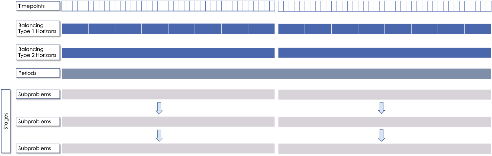

*******************
Basic Functionality
*******************

GridPath can be used to create optimization problems with different features
and varying levels of complexity. For the basic model, the user must
define the model's temporal setup (e.g. 365 individual days at an hourly
resolution), the geographic setup (e.g. a single load zone), the
availability and operating characteristics of the generation infrastructure
(e.g. an existing 500-MW coal plant with a specified heat rate), and the
desired objective (e.g. minimize cost).

.. _temporal-setup-section-ref:

Temporal Setup
==============

GridPath's temporal span and resolution are flexible: the user can decide on
a temporal setup by assigning appropriate weights to and relationships among
GridPath's temporal units.

The temporal units include:

Timepoints
----------

*Timepoints* are the finest resolution over which operational decisions are
made (e.g. an hour). Generator commitment and dispatch decisions are made for
each timepoint, with some constraints applied across timepoints (e.g. ramp
constraints.) Most commonly, a timepoint is an hour, but the resolution is
flexible: a timepoint could also be a 15-minute, 5-minute, 1-minute, or 4-hour
segment. Different timepoint durations can also be mixed, e.g. some can be
5-minute segments and some can be hours.

Timepoints can also be assigned weights in order to represent other
timepoints that are not modeled explicitly (e.g. use a 24-hour period per month
to represent the whole month using the number of days in that month for the
weight of each of the 24 timepoints).

Balancing Types and Horizons
----------------------------

GridPath organizes timepoints into *balancing types* and *horizons* that
describe how *timepoints* are grouped together when making operational
decisions, with some operational constraints enforced over the *horizon* for
each *balancing type*, e.g. hydro budgets or storage energy balance. As a
simple example, in the case of modeling a full year with 8760 timepoints, we
could have three *balancing types*: a day, a month, and a year; there would
then be 365 *horizons* of the *balancing type* 'day,' 12 *horizons* of the
*balancing type* 'month,' and 1 *horizon* of the *balancing type* 'year.'
Within each balancing types, horizons are modeled as independent from each
other for operational purposes (i.e operational decisions made on one
horizon do not affect those made on another horizon). Generator and storage
resources in GridPath are also assigned *balancing types*: a hydro plant
of the *balancing type* 'day' would have to meet an energy budget constraint
on each of the 365 'day' *horizons* whereas one of the *balancing type*
'year' would only have a single energy budget constraint grouping all 8760
timepoints.

Each *horizon* has boundary condition that can be 'circular' or 'linear.' With
the 'circular' approach, the last timepoint of the horizon is considered the
previous timepoint for the first timepoint of the horizon (for the purposes
of functionality such as ramp constraints or tracking storage state of
charge). If the boundary is 'linear,' then we ignore constraints relating to
the previous timepoint in the first timepoint of a horizon.

Periods
-------

Each *timepoint* in a GridPath model also belong to a *period* (e.g. an year),
which describes when decisions to build or retire infrastructure are made. A
*period* must be specified in both capacity-expansion and production-cost
model. In a production-cost simulation context, we can use the period to
exogenously change the amount of available capacity, but the *period*
temporal unit is mostly used in the capacity-expansion approach, as it
defines when capacity decisions are made and new infrastructure becomes
available (or is retired). That information in turn feeds into the horizon-
and timepoint-level operational constraints, i.e. once a generator is build,
the optimization is allowed to operate it in subsequent periods (usually for
the duration of the generators's lifetime). The *period* duration is
flexible: e.g. capacity decisions can be made every month, every year, every
10 years, etc. A discount factor can also be applied to weight costs
differently depending on when they are incurred.

Subproblems
-----------

In production-cost simulation, we often model operations during a full
year, e.g. at an hourly resolution (8760 *timepoints*). However, not all
*timepoints* are optimized together. Usually, each day or week of the year
is optimized separately. In GridPath, these separate optimizations are
called *subproblems*. Each *subproblem* can then contain different balancing
types and horizons. For example, if we are optimizing the year's operations
a week at a time, we would have 52 *subproblems*. Each one of those
*subproblems* could then have two *balancing types* -- a week and a day --
meaning each *timepoint* in the *subproblem* would belong to one of seven
'day' *horizons* and the single 'week' *horizon* (i.e. some resources would
have to be balanced on each day of the week and some over the entire week).

Unlike in production-cost simulation, in capacity-expansion mode, we usually
have only a single subproblem.

Stages
------

GridPath also has multi-stage commitment functionality, i.e. decisions made
for a subproblem can be fixed and then fed into a next stage with some updated
parameters (e.g. an updated load and renewable output forecast). The number
of stages is flexible and the timepoint resolution can change from stage to
stage. The typical temporal setup for production cost simulation
(multi-stage with horizons optimized one at a time) is shown below:

Examples
--------

Typical temporal setup for capacity-expansion modeling is shown below:

.. image:: ../graphics/temporal_cap_exp.png

Typical temporal setup for production-cost modeling is shown below:

Geographic Setup
================

Load Zones
----------

The main geographic unit in GridPath is the *load zone*. The load zone is
the level at which the load-balance constraints are enforced. In GridPath,
we can model a single load zone (copper plate) or multiple load zones, which
can be connected with transmission. This flexibility makes it possible to
apply to different regions with different geographic set-up or to take
different geographic approaches in modeling the same region (e.g. higher or
lower zonal resolution for the same region).

Other Geographic Units
----------------------

Optional levels of geographic resolution include *balancing areas* (BAs) for
operational and reliability reserve requirements and *policy zones* for
policy requirements. In GridPath, it is possible for generators in the same
load zone to contribute to different reserve balancing areas and/or policy
zones. Two possible configurations are shown below.

Geographic Configuration 1:

Geographic Configuration 2:

Projects
========

Generation, storage, and load-side resources in GridPath are called
*projects*. Each project is associated with a *load zone* whose load-balance
constraint it contributes to. In addition, each project must be assigned a
*capacity type*, an *availability type*, and an *operational type*. These
types are described in more detail below.

.. _project-capacity-type-section-ref:

Project Capacity Types
----------------------
Each project in GridPath must be assigned a *capacity type*. The *capacity
type* determines the capacity and the capacity-associated costs of
generation, storage, and demand-side infrastructure *projects* in the
optimization problem. The currently implemented capacity types include:

Specified Generation (*gen_spec*)
^^^^^^^^^^^^^^^^^^^^^^^^^^^^^^^^^
This capacity type describes generators that are available to the optimization
without having to incur an investment cost, e.g. existing generators or
generators that will be built in the future and whose capital costs we want
to ignore (in the objective function). A specified generator can be available
in all periods, or in some periods only, with no restriction on the order
and combination of periods. The user may specify a fixed O&M cost for these
generators, but this cost will be a fixed number in the objective function
and will therefore not affect any of the optimization decisions.

Specified Generation with Linear Economic Retirement (*gen_ret_lin*)
^^^^^^^^^^^^^^^^^^^^^^^^^^^^^^^^^^^^^^^^^^^^^^^^^^^^^^^^^^^^^^^^^^^
This capacity type describes generators with the same characteristics as
*gen_ret_lin*, but whose fixed O&M cost can be avoided by 'retiring' them.
The optimization can make the decision to retire generation in each study
*period*. Once retired, the generator may not become operational
again. Retirement decisions for this capacity type are 'linearized,' i.e.
the optimization may retire generators partially (e.g. retire only 200 MW of
a 500-MW generator). If retired, the annual fixed O&M cost of these projects
is avoided in the objective function.

Specified Generation with Binary Economic Retirement (*gen_ret_bin*)
^^^^^^^^^^^^^^^^^^^^^^^^^^^^^^^^^^^^^^^^^^^^^^^^^^^^^^^^^^^^^^^^^^^
This capacity type describes generators with the same characteristics as
*gen_ret_lin*. However, retirement decisions are binary, i.e. the generator
is either fully retired or not retired at all.

Linear New-Build Generation (*gen_new_lin*)
^^^^^^^^^^^^^^^^^^^^^^^^^^^^^^^^^^^^^^^^^^^
This capacity type describes generation that can be built by the
optimization at a cost. These investment decisions are linearized, i.e.
the decision is not whether to build a unit of a specific size (e.g. a
50-MW combustion turbine), but how much capacity to build at a particular
*project*. Once built, the capacity exists for the duration of the
generator's pre-specified lifetime. Minimum and maximum capacity constraints
can be optionally implemented. The cost input to the model is a annualized
cost per unit capacity. If the optimization makes the decision to build
new capacity, the total annualized cost is incurred in each period of the study
(and multiplied by the number of years the period represents) for the
duration of the project's lifetime. Annual fixed O&M costs are also incurred
by linear new-build generation.

Binary New-Build Generation (*gen_new_bin*)
^^^^^^^^^^^^^^^^^^^^^^^^^^^^^^^^^^^^^^^^^^^
This capacity type describes generation units of a pre-specified size, costs,
and operational characteristics that can either be built by the optimization
or not in all or some investment *periods*. Once built, the capacity remains
available for the duration of the project's pre-specified lifetime.

Specified Storage (*stor_spec*)
^^^^^^^^^^^^^^^^^^^^^^^^^^^^^^^
This capacity type describes the power (i.e. charging and discharging
capacity) and energy capacity (i.e. duration) of storage projects that are
available to the optimization without having to incur an investment cost.
For example, it can be applied to existing storage projects or to
storage projects that will be built in the future and whose capital costs we
want to ignore (in the objective function).

It is not required to specify a capacity for all periods, i.e. a project can
be operational in some periods but not in others with no restriction on the
order and combination of periods. The user may specify a fixed O&M cost for
specified-storage projects, but this cost will be a fixed number in the
objective function and will therefore not affect any of the optimization
decisions.

Linear New-Build Storage (*stor_new_lin*)
^^^^^^^^^^^^^^^^^^^^^^^^^^^^^^^^^^^^^^^^^
This capacity type describes storage projects that can be built by the
optimization at a cost. Investment decisions made separately for the
project's power capacity and its energy capacity, therefore endogenously
determine the sizing of the storage. The decisions are linearized (i.e. the
model decides how much power capacity and how much energy capacity to build
at a project, not whether or not to built a project of pre-defined capacity).
Once built, these storage projects remain available for the duration of their
pre-specified lifetime. Minimum and maximum power capacity and duration
constraints can be optionally implemented. Like with new-build generation,
capacity costs added to the objective function include the annualized
capital cost and the annual fixed O&M cost.

Binary New-Build Storage (*stor_new_bin*)
^^^^^^^^^^^^^^^^^^^^^^^^^^^^^^^^^^^^^^^^^^^
This capacity type describes storage units of pre-specified size, costs, and
operational characteristics that can either be built by the optimization or
not in all or some investment *periods*.

Shiftable Load Supply Curve (*dr_new*)
^^^^^^^^^^^^^^^^^^^^^^^^^^^^^^^^^^^^^^
This capacity type describes a supply curve for new shiftable load capacity.
This type is a custom implementation for GridPath projects in the California
Integrated Resource Planning proceeding.

Project Availability Types
--------------------------
Each *project* in GridPath must be assigned an *availability type* that
determines how much of a project's capacity is available to operate in each
*timepoint*. For example, some or all of a project's capacity may be
unavailable due to maintenance and other planned or unplanned outages. The
following *availability types* have been implemented.

Exogenous
^^^^^^^^^
For each project assigned this *availability type*, the user may specify an
(un)availability schedule, i.e. a capacity derate of 0 to 1 for each
timepoint in which the project may be operated. If fully derated in a given
timepoint, the available project capacity will be 0 in that timepoint and all
operational decision variables will therefore also be constrained to 0 in the
optimization.

Binary
^^^^^^
*Projects* assigned this availability type have binary decision variables
for their availability in each timepoint. This type can be useful in
optimizing planned outage schedules. A *project* of this type is constrained
to be unavailable for at least a pre-specified number of hours in each
*period*. In addition, each unavailability event can be constrained to be
within a minimum and maximum number of hours, and constraints can also be
implemented on the minimum and maximum duration between unavailability events.

Continuous
^^^^^^^^^^
This *availability type* is formulated like the *binary* type except that
all binary decision variables are relaxed to be continuous with bounds
between 0 and 1. This can be useful to address computational difficulties
when modeling endogenous *project* availabilities.

Project Operational Types
-------------------------
Each project in GridPath must be assigned an *operational type*. The
*operational_type* determines the operational capabilities of a project. The
currently implemented operational types include:

Simple Generation (*gen_simple*)
^^^^^^^^^^^^^^^^^^^^^^^^^^^^^^^^
This operational type describes generators that can vary their output
between 0 and full capacity in every timepoint in which they are available
(i.e. they have power output variable but no commitment variables associated
with them). The heat rate of these generators does not degrade below full
load and they can be allowed to provide upward and/or downward reserves.
Costs for this operational type include fuel costs, variable O&M costs, and
startup and shutdown costs.

Must-Run Generation (*gen_must_run*)
^^^^^^^^^^^^^^^^^^^^^^^^^^^^^^^^^^^^
This operational type describes generators that produce constant power equal
to their capacity in all timepoints when they are available. They cannot
provide reserves. Costs for this operational type include fuel costs and
variable O&M costs.

Always-On Generation (*gen_always_on*)
^^^^^^^^^^^^^^^^^^^^^^^^^^^^^^^^^^^^^^
This operational type describes generators that must produce power in all
timepoints they are available; unlike the must-run generators, however, they
can vary power output between a pre-specified minimum stable level (greater
than 0) and their available capacity. Always-on generators cannot provide
reserves. Ramp rate limits can be optionally specified. Costs for this
operational type include fuel costs and variable O&M costs.

Binary-Commit Generation (*gen_commit_bin*)
^^^^^^^^^^^^^^^^^^^^^^^^^^^^^^^^^^^^^^^^^^^
This operational types describes generators that can be turned on and off,
i.e. that have binary commitment variables associated with them. The
optimization makes commitment and power output decisions in every timepoint.
If the generators are not committed, power output is 0. If they are
committed, these generators can vary power output between a pre-specified
minimum stable level (greater than 0) and their available capacity. Run-up
and shut-down trajectories can be optionally modeled. Heat rate degradation
below full load is considered. These generators can optionally be allowed to
provide upward and/or downward reserves. Ramp rate limits as well us minimum
up and down time constraints are implemented. Starts and stops -- and the
associated cost and emissions -- can be tracked and constrained for these
generators. Costs for this operational type include fuel costs, variable O&M
costs, and startup and shutdown costs.

Continuous-Commit Generation (*gen_commit_lin*)
^^^^^^^^^^^^^^^^^^^^^^^^^^^^^^^^^^^^^^^^^^^^^^^
This operational type is the same as the *gen_commit_bin* operational type,
but the commitment decisions are declared as continuous (with bounds of 0 to
1) instead of binary, so 'partial' generators can be committed. This
treatment can be helpful in situations when mixed-integer problem runtimes
are long and is similar to loosening the MIP gap (but can target specific
generators).

Capacity-Commit Generation (*gen_commit_cap*)
^^^^^^^^^^^^^^^^^^^^^^^^^^^^^^^^^^^^^^^^^^^^^

This operational type is particularly well suited for application to 'fleets'
of generators with the same characteristics. For example, we could have a
GridPath project with a total capacity of 2000 MW, which actually consists
of four 500-MW units. The optimization decides how much total capacity to
commit (i.e. turn on), e.g. if 2000 MW are committed, then four generators (x
500 MW) are on and if 500 MW are committed, then one generator is on, etc.
The capacity commitment decision variables are continuous. This approach
makes it possible to reduce problem size by grouping similar generators
together and linearizing the commitment decisions.

The optimization makes the capacity-commitment and dispatch decisions in
every timepoint. Project power output can vary between a minimum loading level
(specified as a fraction of committed capacity) and the committed capacity
in each timepoint when the project is available. Heat rate degradation below
full load is considered. These projects can be allowed to provide upward
and/or downward reserves.

No standard approach exists for applying ramp rate and minimum up and down
time constraints to this operational type. GridPath does include
experimental functionality for doing so. Starts and stops -- and the
associated cost and emissions -- can also be tracked and constrained for
this operational type.

Costs for this operational type include fuel costs, variable O&M costs, and
startup and shutdown costs.

Curtailable Hydro Generation (*gen_hydro*)
^^^^^^^^^^^^^^^^^^^^^^^^^^^^^^^^^^^^^^^^^
This operational type describes the operations of hydro generation. These
projects can vary power output between a minimum and maximum level specified
for each horizon, and must produce a pre-specified amount of energy on each
horizon when they are available, some of which may be curtailed. The
curtailable hydro projects can be allowed to provide upward and/or downward
reserves. Timepoint-to-timepoint ramp rate limits can optionally be enforced.
Costs for this operational type include variable O&M costs.

Non-Curtailable Hydro Generation (*gen_hydro_must_take)
^^^^^^^^^^^^^^^^^^^^^^^^^^^^^^^^^^^^^^^^^^^^^^^^^^^^^^^
This operational type describes the operations of hydro generation and is
like the *gen_hydro* operational type except that curtailment is not
allowed.

Curtailable Variable Generation (*gen_var*)
^^^^^^^^^^^^^^^^^^^^^^^^^^^^^^^^^^^^^^^^^^^
This operational type describes generators whose power output is equal to a
pre-specified fraction of their available capacity (a capacity factor
parameter) in every timepoint. Curtailment is allowed. GridPath includes
experimental features to allow these generators to provide upward and/or
downward reserves. Costs for this operational type include variable O&M costs.

Non-curtailable Variable Generation (*gen_var_must_take*)
^^^^^^^^^^^^^^^^^^^^^^^^^^^^^^^^^^^^^^^^^^^^^^^^^^^^^^^^^
This operational type is like the *gen_var* type except that curtailment is
not allowed.

Storage (*stor*)
^^^^^^^^^^^^^^^^
This operational type describes a generic storage resource. It can be
applied to a battery, to a pumped-hydro project or another storage
technology. The type is associated with three main variables in each
timepoint when the project is available: the charging level, the discharging
level, and the energy available in storage. The first two are constrained to
be less than or equal to the project's power capacity. The third is
constrained to be less than or equal to the project's energy capacity. The
model tracks the stage of charge in each timepoint based on the charging and
discharging decisions in the previous timepoint, with adjustments for
charging and discharging efficiencies. Storage projects can be allowed to
provide upward and/or downward reserves. Costs for this operational type
include variable O&M costs.

Shiftable Load (*dr_shift*)
^^^^^^^^^^^^^^^^^^^^^^^^^^^
This operational type describes a generic shiftable load resource. There are
two opertional variables in each timepoint: one for shifting load up (adding
load) and another for shifting load down (subtracting load). These cannot
exceed the power capacity of the project and must meet an energy balance
constrain on each horizon. Efficiency losses are not currently implemented.
There are two opertional variables: shift load up (add load) and shift load
down (subtract load). These cannot exceed the power capacity of the project
and must meet an energy balance constraint on each horizon (no efficiency
loss implemented).

.. _load-balance-section-ref:

Load Balance
============

The load-balance constraint in GridPath consists of production components
and consumption components that are added by various GridPath modules
depending on the selected features. The sum of the production components
must equal the sum of the consumption components in each zone and timepoint.

At a minimum, for each load zone and timepoint, the user must specify a
static load requirement input as a consumption component. On the production
side, the model aggregates the power output of projects in the respective
load zone and timepoint.

.. note:: Net power output from storage and demand-side resources can be
    negative and is currently aggregated with the 'project' production
    component.

Net transmission into/out of the load zone is another possible production
component (see 'Transmission' section under 'Optional Functionality' below).

The user may also optionally allow unserved energy and/or overgeneration to be
incurred by adding the respective variables to the production and
consumption components respectively, and assigning a per unit cost for each
load-balance violation type.

.. _objective-section-ref:

Objective Function
==================

GridPath's objective function consists of modularized components. This
modularity allows for different objective functions to be defined. Here, we
discuss the objective of minimizing total system costs.

Its most basic version includes the aggregated project capacity costs and
aggregated project operational costs, and any load-balance penalties
incurred (i.e. the aggregated unserved energy and/or overgeneration costs).

Other standard objective function components include:

    * aggregated transmission line capacity investment costs
    * aggregated transmission operational costs (hurdle rates)
    * aggregated reserve violation penalties

GridPath also can include custom objective function components that may not
be standard for all systems. Examples currently include:

    * local capacity shortage penalties
    * planning reserve margin costs
    * various tuning costs

All costs are net present value costs, with a user-specified discount factor
applied to call costs depending on the period in which they are incurred.

**********************
Optional Functionality
**********************

Transmission
============
In GridPath, the user can include transmission line flows and transmission
topography by selecting the 'transimssion' feature and specifying the
available transmission lines and which load zones they connect.

For each load zone and timepoint, the net flow on all transmission lines
connected to the load zone is aggregated and added as a production
component to the load balance constraint (see
:ref:`load-balance-section-ref`).

.. note:: If there is a net flow *out* of a load zone, the load-balance
    constraint 'production' component is a negative number.

Transmission features modules also add a transmission-capacity-costs
component and a transmission-operational-costs component to the objective
function (see :ref:`objective-section-ref`).

Like with GridPath 'projects,' transmission lines must be assigned a
capacity type, which determines their capacity availability and costs, and an
operational type, which determines their operational characteristics and costs.

The transmission network in GridPath can currently be modeled using a linear
transport model only. In the future, we may add DC and/or AC network
capability.

Transmission Capacity Types
---------------------------
Each transmission line in GridPath must be assigned a *capacity type*. The
line's *capacity type* determines the available transmission capacity and the
capacity-associated costs. The currently implemented capacity types include:

Specified Transmission (*tx_spec*)
^^^^^^^^^^^^^^^^^^^^^^^^^^^^^^^^^^
This capacity type describes transmission lines that are available to the
optimization without having to incur an investment cost, e.g. existing
lines or lines that will be built in the future and whose capital costs
we want to ignore (in the objective function). A specified transmission line
can be available in all periods, or in some periods only, with no
restriction on the order and combination of periods. The two transmission
line directions may have different specified capacites.

Linear New-Build Transmission (*tx_new_lin*)
^^^^^^^^^^^^^^^^^^^^^^^^^^^^^^^^^^^^^^^^^^^^

This capacity type describes transmission that can be built by the
optimization at a cost. These investment decisions are linearized, i.e.
the decision is not whether to build a specific transmission line, but how
much capacity to build at a particular transmission corridor. Once built, the
capacity remains available for the duration of the line's pre-specified
lifetime. The cost input to the model is an annualized cost per unit capacity.
If the optimization makes the decision to build new capacity, the total
annualized cost is incurred in each period of the study (and multiplied by
the number of years the period represents) for the duration of the project's
lifetime. Annual fixed O&M costs are also incurred by linear new-build
transmission lines.

Transmission Operational Types
------------------------------
Transmission lines in GridPath must be assigned an *operational type*. The
*operational type* determines the formulation of the operational
capabilities of the transmission line. The *operational types* currently
implemented include:

Linear Transport Transmission (*tx_simple*)
^^^^^^^^^^^^^^^^^^^^^^^^^^^^^^^^^^^^^^^^^^^
Transmission line flows are simulated using a linear transport model,
i.e. transmission flow is constrained to be less than or equal to the line
capacity.

DC Power Flow (*tx_dcopf*)
^^^^^^^^^^^^^^^^^^^^^^^^^^
GridPath can also model DC power flow on the transmission network by
assigning the *tx_dcopf* operational type to the transmission lines modeled.
DC power flow is a linearized approach to the AC Power Flow problem, which
is a non-linear, non-convex set of equations describing the energy flow
through each transmission line. The three main assumptions for the DC power
flow approximation are: 1) line resistances are negligible compared to line
reactances, so reactive power flows can be neglected; 2) voltage magnitudes at
each bus are kept at their nominal value; and 3) voltage angle differences
across branches are small enough such that the sine of the difference can be
approximated by the difference, i.e. :math:`\sin(\theta) \approx \theta`.

Using these approximations, the power flow problem becomes linear and can be
added to our capacity-expansion / unit commitment model using an additional
set of constraints for flows on each *tx_dcopf* line.

.. warning:: Transmission operational types can be optionally be mixed.
    However, if there are any transmission lines that do not have the
    *tx_dcopf* operational types, they will simply not be considered when
    setting up the network constraints laid out in the *tx_dcopf* module, so
    the network flows will be inaccurate.

.. warning:: GridPath uses one user-specified reactance to characterize a
    transmission line and this value doesn't change across time periods, even
    when the planned transmission capacity changes or when the model selects to
    build additional capacity (in the case of new build transmission). If
    this is not a reasonable assumption for the transmission system of
    interest, we recommended not to use the *tx_dcopf* operational type.

Operating Reserves
==================
GridPath can optionally model a range of operating reserve types, including
regulation up and down, spinning reserves, load-following up and down, and
frequency response. The implementation of each reserve type is standardized.
The user must define the reserve balancing areas along with any penalties
for violation of the reserve-balance constraints. For each balancing area,
the reserve requirement for each timepoint must be specified. Only
exogenously-specified reserves are implemented at this stage. Each project
that can provide the reserve type must then be assigned a balancing area to
whose reserve-balance constraint it can contribute. The project-level
reserve-provision variables are dynamically added to the project's operating
constraints if the project can provide each reserve type. Total reserve
provision by projects in each balancing area is then aggregated and
constrained to equal the BA's reserve requirement in each timepoint. The
user can optionally allow these constraints to be violated at a cost. Any
reserve-balance constraint violation penalty costs are added to the
objective function.

Reliability
===========
GridPath can optionally model a planning-reserve capacity requirement (PRM).
The user must the define the zones with a PRM requirement and the
requirement level for each PRM zone and period. Each project that can
contribute capacity (i.e. expected load-carrying capability -- ELCC --
greater than 0) must be assigned a PRM zone to whose reserve-balance
constraint it can contribute. The PRM reserve-balance constraint is a
period-level constraint. Projects can contribute a fraction of their
capacity as their ELCC via the *prm_simple* module. See
:ref:`custom-modules-section-ref`) for some advanced reliability functionality.

Policy
======

Renewable Portfolio Standard (RPS)
----------------------------------
GridPath can optionally impose renewable portfolio standard requirements.
The user must first define the zones with an RPS requirement. The RPS
requirement is a period-level constraint (not all periods must have a
requirement). Each RPS-eligible project must be assigned an RPS zone to
whose requirement it can contribute. The amount of RPS-eligible energy a
project contributes in each timepoint is determined by its operational type
(e.g. a must-run biomass plant will contribute its full capacity times the
timepoint duration in every timepoint while a wind project will contribute
its capacity factor times its capacity). The model aggregates all projects'
contributions for each period and ensures that the RPS requirement is met in
each RPS zone and period.

Carbon Cap
----------
GridPath can optionally impose an carbon cap constraint. The user must
first define the zones with an emissions cap and the cap level by period (not
all periods must have a requirement). Each carbon-emitting project must be
assigned a *carbon cap zone* to whose emissions it can contribute. The amount
of carbon emissions from a project in each timepoint is determined by its
operational type and fuel. The model aggregates all projects' contributions
for each period and ensures that the total emissions stay below the cap in
each *carbon cap zone* and *period*.

GridPath can also optionally apply an emissions factor to energy imports
into an emissions zone. For the purpose, the relevant transmission lines
(i.e. transmission lines that connect the emissions zone to other zones)
must be assigned an emissions zone and an emissions intensity per unit
energy. These emissions are then added to the emissions cap constraint.

The emissions cap could be applied to carbon emissions or to other types of
emissions.

.. _custom-modules-section-ref:

Custom Modules
==============
GridPath can include custom modules depending on the region or
system models. For example, for studies in the California
Integrated Resource Planning proceedings, GridPath includes
constraints on transmission simultaneous flow limits and advanced reliability
functionality such as:

* *ELCC surface module*: this module has substantial exogenous data
  requirements, but makes it possible to dynamically adjust the ELCC of some
  projects depending on the resource build-out (e.g. as more solar is built,
  the marginal ELCC becomes smaller)
* *Energy-only / partial deliverability*: ability to de-rate ELCC eligibility
  to less than the full project capacity (before applying the simple PRM
  fraction or the ELCC surface), since in some cases full deliverability may
  require additional costs to be incurred (e.g. for transmission, etc.)
* *Energy-limits*: additional limits on ELCC based on energy-limitations
  (e.g. for storage)

Similar custom functionality can be added for other systems and easily
excluded when not needed.

**********
Approaches
**********

GridPath can be used in production-cost simulation or capacity-expansion mode
depending on whether "projects" of the "new_build" capacity types are included
in the model. To be implemented is functionality to change the objective
function in order to be able to take an asset-valuation approach (i.e. profit-
maximization instead of cost-minimization) or optimize for something other
than cost (e.g. minimize CO2 emissions).

Production-Cost Simulation
==========================

Production-cost simulation models, also called unit-commitment and dispatch
models, simulate the operations of a specified power system with a high
level fidelity -- at a high temporal resolution (e.g. hours to 5-minute
segments) and considering the detailed operating characteristics of
generators -- but generally over a fairly short period of time (e.g.
optimizing a year one day at a time). These models are adept at optimizing
the day-to-day operations of a fixed electric power system, provide
information on system reliability, assess transmission congestion, and
produce simulated locational marginal prices. They can also be used to
evaluate the impact of additions or retirements of capacity. As the number
of resources under considerations increases, however, so does the
number of possible combinations we need to simulate, making analysis using
production-cost simulation increasingly intensive and cumbersome. Answering
questions about how to develop the grid in the future as demand,
technologies, and policies change therefore requires additional types of
modeling capability.

Capacity-Expansion
==================

While production cost simulation models seek to optimize the operations of a
power system with a fixed set of resources specified by the user,
capacity-expansion models are designed to understand how the system should
evolve over time: they try to answer the question of what resources to
invest in among many options in order to meet system goals over time, i.e.
what grid infrastructure is most cost-effective while ensuring that the
system operates reliably and meeting policy targets.

The capacity expansion model minimizes the overall system cost over some
planning horizon, considering both capital costs (generators, transmission,
storage, any asset) and variable or operating costs subject to various
technical (e.g. generator limits, wind and solar availability, transmission
limits across corridors, hydro limits) and policy constraints (e.g.
renewable energy mandates, GHG targets).

Because capacity-expansion models have to optimize over several years or
decades, selecting generation, and transmission assets from many different
available options, the problem can get large quickly. In order to have
reasonable runtime, these models often simplify aspects of the electricity
grid, both in space and time. Spatially, most models will consider only
balancing areas or states as nodes (so all substations with the BA are
clubbed together). Temporally, only representative days and hours may be
used, and then given weights to represent a whole year e.g. one day per
month, and either 24 hours, or 6 time blocks (each representing 4 hours).
This simplification makes the linear optimization problem tractable. If the
spatial resolution is small, the temporal resolution may be increased, and
vice versa. An advantage of GridPath is that, unlike other similar
platforms, it leaves the decision for where to simplify and where to add
resolution is left up to the user, making it possible to tailor the problem
formulation to the question at hand, the available computational resources,
and the available time.

After the system is “built” by a capacity-expansion problem, the system should
be simulated for the entire year (or years) using a production-cost model to
ensure that the decisions made using representative time slices produce a
system that can operate reliably at every time point of the year. The
production cost model takes a given electric system (similar to the
Greening-the-Grid study that used the CEA plans) and solves the model to
ensure demand equals supply, and all constraints like generator limits,
transmission flows, ramp rates, and policy constraints are all met.

Capacity-expansion and production cost models are therefore complementary.
The former allows us to quickly explore many options for how the power
system ought to evolve over time and find the optimal solution; the latter
can help us ensure that the system we design does in fact perform as we
intended (e.g. that it serves load reliably and meets policy targets).

GridPath's architecture makes it possible for the same modules to be re-used
in production-cost or capacity-expansion modeling settings, allowing for a
seamless transition from one approach to the other, as datasets can be more
easily reused.

Linear, Mixed-Integer, and Non-Linear Formulations
==================================================

Depending on how modules are combined, linear, mixed-integer, and non-linear
problem formulations are possible in GridPath. Some modules are
interchangeable, with the variable domain (e.g. binary vs. continuous with 0
to 1 bounds) the only difference in the final formulation.
