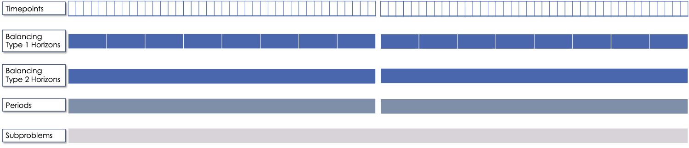

###################################
GridPath Functionality - High Level
###################################

In this chapter, we discuss Gridpath's functionality at a high level. It is
subdivided into three sections:

1. :ref:`approaches-section-ref`
2. :ref:`basic-functionality-section-ref`
3. :ref:`optional-functionality-section-ref`

.. _approaches-section-ref:

**********
Approaches
**********

GridPath can be used in production-cost simulation or capacity-expansion mode
depending on whether "projects" of the "new" capacity types are included
in the model. To be implemented is functionality to change the objective
function in order to be able to take an asset-valuation approach (i.e. profit-
maximization instead of cost-minimization) or optimize for something other
than cost (e.g. minimize CO2 emissions).

Production-Cost Simulation
==========================

Production-cost simulation models, also called unit-commitment and dispatch
models, simulate the operations of a specified power system with a high
level fidelity -- at a high temporal resolution (e.g. hours to 5-minute
segments) and considering the detailed operating characteristics of
generators -- but generally over a fairly short period of time (e.g.
optimizing a year one day at a time). These models are adept at optimizing
the day-to-day operations of a fixed electric power system, provide
information on system reliability, assess transmission congestion, and
produce simulated locational marginal prices. They can also be used to
evaluate the impact of additions or retirements of capacity. As the number
of resources under considerations increases, however, so does the
number of possible combinations we need to simulate, making analysis using
production-cost simulation increasingly intensive and cumbersome. Answering
questions about how to develop the grid in the future as demand,
technologies, and policies change therefore requires additional types of
modeling capability.

Capacity-Expansion
==================

While production cost simulation models seek to optimize the operations of a
power system with a fixed set of resources specified by the user,
capacity-expansion models are designed to understand how the system should
evolve over time: they try to answer the question of what resources to
invest in among many options in order to meet system goals over time, i.e.
what grid infrastructure is most cost-effective while ensuring that the
system operates reliably and meeting policy targets.

The capacity expansion model minimizes the overall system cost over some
planning horizon, considering both capital costs (generators, transmission,
storage, any asset) and variable or operating costs subject to various
technical (e.g. generator limits, wind and solar availability, transmission
limits across corridors, hydro limits) and policy constraints (e.g.
renewable energy mandates, GHG targets).

Because capacity-expansion models have to optimize over several years or
decades, selecting generation, and transmission assets from many different
available options, the problem can get large quickly. In order to have
reasonable runtime, these models often simplify aspects of the electricity
grid, both in space and time. Spatially, most models will consider only
balancing areas or states as nodes (so all substations with the BA are
clubbed together). Temporally, only representative days and hours may be
used, and then given weights to represent a whole year e.g. one day per
month, and either 24 hours, or 6 time blocks (each representing 4 hours).
This simplification makes the linear optimization problem tractable. If the
spatial resolution is small, the temporal resolution may be increased, and
vice versa. An advantage of GridPath is that, unlike other similar
platforms, it leaves the decision for where to simplify and where to add
resolution is left up to the user, making it possible to tailor the problem
formulation to the question at hand, the available computational resources,
and the available time.

After the system is “built” by a capacity-expansion problem, the system should
be simulated for the entire year (or years) using a production-cost model to
ensure that the decisions made using representative time slices produce a
system that can operate reliably at every time point of the year. The
production cost model takes a given electric system (similar to the
Greening-the-Grid study that used the CEA plans) and solves the model to
ensure demand equals supply, and all constraints like generator limits,
transmission flows, ramp rates, and policy constraints are all met.

Capacity-expansion and production cost models are therefore complementary.
The former allows us to quickly explore many options for how the power
system ought to evolve over time and find the optimal solution; the latter
can help us ensure that the system we design does in fact perform as we
intended (e.g. that it serves load reliably and meets policy targets).

GridPath's architecture makes it possible for the same modules to be re-used
in production-cost or capacity-expansion modeling settings, allowing for a
seamless transition from one approach to the other, as datasets can be more
easily reused.

Linear, Mixed-Integer, and Non-Linear Formulations
==================================================

Depending on how modules are combined, linear, mixed-integer, and non-linear
problem formulations are possible in GridPath. Some modules are
interchangeable, with the variable domain (e.g. binary vs. continuous with 0
to 1 bounds) the only difference in the final formulation.

.. _basic-functionality-section-ref:

*******************
Basic Functionality
*******************

GridPath can be used to create optimization problems with different features
and varying levels of complexity. For the basic model, the user must
define:

* :ref:`temporal-setup-section-ref` : The model's temporal setup (e.g. 365
  individual days at an hourly resolution),
* :ref:`geographic-setup-section-ref` : The geographic setup (e.g. a single
  load zone),
* :ref:`project-setup-section-ref` : The availability and operating
  characteristics of the generation infrastructure (e.g. an existing 500-MW coal
  plant with a specified heat rate),
* :ref:`objective-section-ref` : The desired objective (e.g. minimize
  cost).

.. _temporal-setup-section-ref:

Temporal Setup
==============

GridPath's temporal span and resolution are flexible: the user can decide on
a temporal setup by assigning appropriate weights to and relationships among
GridPath's temporal units.

The temporal units include:

.. _timepoints-sub-section-ref:

Timepoints
----------

*Timepoints* are the finest resolution over which operational decisions are
made (e.g. an hour). Generator commitment and dispatch decisions are made for
each timepoint, with some constraints applied across timepoints (e.g. ramp
constraints.) Most commonly, a timepoint is an hour, but the resolution is
flexible: a timepoint could also be a 15-minute, 5-minute, 1-minute, or 4-hour
segment. Different timepoint durations can also be mixed, e.g. some can be
5-minute segments and some can be hours.

Timepoints can also be assigned weights in order to represent other
timepoints that are not modeled explicitly (e.g. use a 24-hour period per month
to represent the whole month using the number of days in that month for the
weight of each of the 24 timepoints).

To support multi-stage production simulation timepoints can also be assigned a
mapping to the previous stage (e.g. timepoints 1-12 in the 5-minute real-time
stage map to timepoint 1 in the hour-ahead stage) and a flag whether the
timepoint is part of a spinup or lookahead segment.
Timepoints that are part of a spinup or lookahead segment are included in the
optimization but are generally discarded when calculating result metrics such as
annual emissions, energy, or cost. See :ref:`subproblems-sub-section-ref` and
:ref:`stages-sub-section-ref` for more information.

Balancing Types and Horizons
----------------------------

.. automodule:: gridpath.temporal.operations.horizons

Periods
-------

Each *timepoint* in a GridPath model also belongs to a *period* (e.g. a year),
which describes when decisions to build or retire infrastructure are made. A
*period* must be specified in both capacity-expansion and production-cost
model. In a production-cost simulation context, we can use the period to
exogenously change the amount of available capacity, but the *period*
temporal unit is mostly used in the capacity-expansion approach, as it
defines when capacity decisions are made and new infrastructure becomes
available (or is retired). That information in turn feeds into the horizon-
and timepoint-level operational constraints, i.e. once a generator is build,
the optimization is allowed to operate it in subsequent periods (usually for
the duration of the generators's lifetime). The *period* duration is
flexible: e.g. capacity decisions can be made every month, every year, every
10 years, etc. A discount factor can also be applied to weight costs
differently depending on when they are incurred.

.. _subproblems-sub-section-ref:

Subproblems
-----------

In production-cost simulation, we often model operations during a full
year, e.g. at an hourly resolution (8760 *timepoints*). However, not all
*timepoints* are optimized together. Usually, each day or week of the year
is optimized separately. In GridPath, these separate optimizations are
called *subproblems*. Each *subproblem* can then contain different balancing
types and horizons. For example, if we are optimizing the year's operations
a week at a time, we would have 52 *subproblems*. Each one of those
*subproblems* could then have two *balancing types* -- a week and a day --
meaning each *timepoint* in the *subproblem* would belong to one of seven
'day' *horizons* and the single 'week' *horizon* (i.e. some resources would
have to be balanced on each day of the week and some over the entire week).

Within a production-cost simulation subproblem, some timepoints can be part
of a spin-up or look-ahead segment. These are additional timepoints that are
added to the subproblem's start and end but are ultimately discarded when
calculating result metrics. They are there to more faithfully model the
beginning and start of the subproblem. For example, if we had weekly subproblems
we could add 24 hourly spinup timepoins (1 day) before the week, and 24
hourly lookahead timepoints (1 day) after the week, resulting in 52 subproblems
of 9 days. After solving each subproblem independently, the 2 edge days in each
subproblem are discarded .

Unlike in production-cost simulation, in capacity-expansion mode, we usually
have only a single subproblem (and no spinup or lookahead timepoints).

.. _stages-sub-section-ref:

Stages
------

GridPath also has multi-stage commitment functionality, i.e. commitment
decisions made for a subproblem can be fixed and then fed into a next stage with
some updated parameters (e.g. an updated load and renewable output forecast).
The number of stages is flexible and the timepoint resolution can change from
stage to stage.

For instance, the same day (subproblem) could first be modeled using a day-ahead
hourly forecast ("DA stage"), then with an hour-ahead hourly forecast ("HA
stage"), and finally with a real-time 5-minute forecast ("RT stage"). Commitment
decisions for e.g. coal generators could be fixed in the DA stage, whereas
commitment for e.g. gas turbines could be changed until the final RT stage.

In practice, this is achieved by assigning a stage to each timepoint and
specifying a map between timepoints in each stage (see
:ref:`timepoints-sub-section-ref`). Load and renewable forecast inputs are
indexed by timepoint and stage, allowing for different forecasts (and,
optionally, timepoint resolutions) in each stage.

Examples
--------

A typical temporal setup for capacity-expansion modeling is shown below. Note
the presence op multiple investment periods, and a single subproblem and stage
(i.e. a single optimization).

A typical temporal setup for production-cost modeling is shown below. Note the
presence of a single period, and multiple subproblems and stages (i.e. an
optimization will be solved for every subproblem-stage combination).

.. image:: ../graphics/temporal_prod_cost.png

.. _geographic-setup-section-ref:

Geographic Setup
================

Load Zones
----------

The main geographic unit in GridPath is the *load zone*. The load zone is
the level at which the load-balance constraints are enforced. In GridPath,
we can model a single load zone (copper plate) or multiple load zones, which
can be connected with transmission. This flexibility makes it possible to
apply to different regions with different geographic set-up or to take
different geographic approaches in modeling the same region (e.g. higher or
lower zonal resolution for the same region).

Other Geographic Units
----------------------

Optional levels of geographic resolution include *balancing areas* (BAs) for
operational and reliability reserve requirements and *policy zones* for
policy requirements. In GridPath, it is possible for generators in the same
load zone to contribute to different reserve balancing areas and/or policy
zones. Two possible configurations are shown below.

Geographic Configuration 1:

.. image:: ../graphics/lz_ba_rel1.png

Geographic Configuration 2:

.. image:: ../graphics/lz_ba_rel2.png

.. _project-setup-section-ref:

Projects
========

Generation, storage, and load-side resources in GridPath are called
*projects*. Each project is associated with a *load zone* whose load-balance
constraint it contributes to. In addition, each project must be assigned a
*capacity type*, an *availability type*, and an *operational type*. These
types are described in more detail below.

.. _project-capacity-type-section-ref:

Project Capacity Types
----------------------
Each project in GridPath must be assigned a *capacity type*. The *capacity
type* determines the capacity and the capacity-associated costs of
generation, storage, and demand-side infrastructure *projects* in the
optimization problem. The currently implemented capacity types include:

Specified Generation (*gen_spec*)
^^^^^^^^^^^^^^^^^^^^^^^^^^^^^^^^^
.. automodule:: gridpath.project.capacity.capacity_types.gen_spec

Specified Generation with Linear Economic Retirement (*gen_ret_lin*)
^^^^^^^^^^^^^^^^^^^^^^^^^^^^^^^^^^^^^^^^^^^^^^^^^^^^^^^^^^^^^^^^^^^^
.. automodule:: gridpath.project.capacity.capacity_types.gen_ret_lin

Specified Generation with Binary Economic Retirement (*gen_ret_bin*)
^^^^^^^^^^^^^^^^^^^^^^^^^^^^^^^^^^^^^^^^^^^^^^^^^^^^^^^^^^^^^^^^^^^^
.. automodule:: gridpath.project.capacity.capacity_types.gen_ret_bin

Linear New-Build Generation (*gen_new_lin*)
^^^^^^^^^^^^^^^^^^^^^^^^^^^^^^^^^^^^^^^^^^^
.. automodule:: gridpath.project.capacity.capacity_types.gen_new_lin

Binary New-Build Generation (*gen_new_bin*)
^^^^^^^^^^^^^^^^^^^^^^^^^^^^^^^^^^^^^^^^^^^
.. automodule:: gridpath.project.capacity.capacity_types.gen_new_bin

Specified Storage (*stor_spec*)
^^^^^^^^^^^^^^^^^^^^^^^^^^^^^^^
.. automodule:: gridpath.project.capacity.capacity_types.stor_spec

Linear New-Build Storage (*stor_new_lin*)
^^^^^^^^^^^^^^^^^^^^^^^^^^^^^^^^^^^^^^^^^
.. automodule:: gridpath.project.capacity.capacity_types.stor_new_lin

Binary New-Build Storage (*stor_new_bin*)
^^^^^^^^^^^^^^^^^^^^^^^^^^^^^^^^^^^^^^^^^^^
.. automodule:: gridpath.project.capacity.capacity_types.stor_new_bin

Shiftable Load Supply Curve (*dr_new*)
^^^^^^^^^^^^^^^^^^^^^^^^^^^^^^^^^^^^^^
.. automodule:: gridpath.project.capacity.capacity_types.dr_new.add_module_specific_components

.. _project-availability-type-section-ref:

Project Availability Types
--------------------------
Each *project* in GridPath must be assigned an *availability type* that
determines how much of a project's capacity is available to operate in each
*timepoint*. For example, some or all of a project's capacity may be
unavailable due to maintenance and other planned or unplanned outages. The
following *availability types* have been implemented.

Exogenous
^^^^^^^^^
.. automodule:: gridpath.project.availability.availability_types.exogenous

Binary
^^^^^^
.. automodule:: gridpath.project.availability.availability_types.binary

Continuous
^^^^^^^^^^
.. automodule:: gridpath.project.availability.availability_types.continuous

Project Operational Types
-------------------------
Each project in GridPath must be assigned an *operational type*. The
*operational_type* determines the operational capabilities of a project. The
currently implemented operational types include:

Simple Generation (*gen_simple*)
^^^^^^^^^^^^^^^^^^^^^^^^^^^^^^^^
.. automodule:: gridpath.project.operations.operational_types.gen_simple

Must-Run Generation (*gen_must_run*)
^^^^^^^^^^^^^^^^^^^^^^^^^^^^^^^^^^^^
.. automodule:: gridpath.project.operations.operational_types.gen_must_run

Always-On Generation (*gen_always_on*)
^^^^^^^^^^^^^^^^^^^^^^^^^^^^^^^^^^^^^^
.. automodule:: gridpath.project.operations.operational_types.gen_always_on

Binary-Commit Generation (*gen_commit_bin*)
^^^^^^^^^^^^^^^^^^^^^^^^^^^^^^^^^^^^^^^^^^^
.. automodule:: gridpath.project.operations.operational_types.gen_commit_bin

Continuous-Commit Generation (*gen_commit_lin*)
^^^^^^^^^^^^^^^^^^^^^^^^^^^^^^^^^^^^^^^^^^^^^^^
.. automodule:: gridpath.project.operations.operational_types.gen_commit_lin

Capacity-Commit Generation (*gen_commit_cap*)
^^^^^^^^^^^^^^^^^^^^^^^^^^^^^^^^^^^^^^^^^^^^^
.. automodule:: gridpath.project.operations.operational_types.gen_commit_cap

Curtailable Hydro Generation (*gen_hydro*)
^^^^^^^^^^^^^^^^^^^^^^^^^^^^^^^^^^^^^^^^^^

.. automodule:: gridpath.project.operations.operational_types.gen_hydro

Non-Curtailable Hydro Generation (*gen_hydro_must_take*)
^^^^^^^^^^^^^^^^^^^^^^^^^^^^^^^^^^^^^^^^^^^^^^^^^^^^^^^^
.. automodule:: gridpath.project.operations.operational_types.gen_hydro_must_take

Curtailable Variable Generation (*gen_var*)
^^^^^^^^^^^^^^^^^^^^^^^^^^^^^^^^^^^^^^^^^^^
.. automodule:: gridpath.project.operations.operational_types.gen_var

Non-curtailable Variable Generation (*gen_var_must_take*)
^^^^^^^^^^^^^^^^^^^^^^^^^^^^^^^^^^^^^^^^^^^^^^^^^^^^^^^^^
.. automodule:: gridpath.project.operations.operational_types.gen_var_must_take

Storage (*stor*)
^^^^^^^^^^^^^^^^
.. automodule:: gridpath.project.operations.operational_types.stor

Shiftable Load (*dr*)
^^^^^^^^^^^^^^^^^^^^^
.. automodule:: gridpath.project.operations.operational_types.dr

.. _load-balance-section-ref:

Load Balance
============

The load-balance constraint in GridPath consists of production components
and consumption components that are added by various GridPath modules
depending on the selected features. The sum of the production components
must equal the sum of the consumption components in each zone and timepoint.

At a minimum, for each load zone and timepoint, the user must specify a
static load requirement input as a consumption component. On the production
side, the model aggregates the power output of projects in the respective
load zone and timepoint.

.. note:: Net power output from storage and demand-side resources can be
    negative and is currently aggregated with the 'project' production
    component.

Net transmission into/out of the load zone is another possible production
component (see :ref:`transmission-section-ref`).

The user may also optionally allow unserved energy and/or overgeneration to be
incurred by adding the respective variables to the production and
consumption components respectively, and assigning a per unit cost for each
load-balance violation type.

.. _objective-section-ref:

Objective Function
==================

GridPath's objective function consists of modularized components. This
modularity allows for different objective functions to be defined. Here, we
discuss the objective of minimizing total system costs.

Its most basic version includes the aggregated project capacity costs and
aggregated project operational costs, and any load-balance penalties
incurred (i.e. the aggregated unserved energy and/or overgeneration costs).

Other standard objective function components include:

    * aggregated transmission line capacity investment costs
    * aggregated transmission operational costs (hurdle rates)
    * aggregated reserve violation penalties

GridPath also can include custom objective function components that may not
be standard for all systems. Examples currently include:

    * local capacity shortage penalties
    * planning reserve margin costs
    * various tuning costs

All costs are net present value costs, with a user-specified discount factor
applied to call costs depending on the period in which they are incurred.

.. _optional-functionality-section-ref:

**********************
Optional Functionality
**********************

GridPath contains a number of modules that are optional. These modules are:

* :ref:`transmission-section-ref` : to model tranmission flows between multiple
  load zones,
* :ref:`operating-reserves-section-ref` : to model reserves such as frequency
  regulation or spinning reserves,
* :ref:`policy-section-ref` : to model policy measures such as a Renewable
  Portfolio Standard (RPS) or a carbon cap,
* :ref:`reliability-section-ref`: to model system reliability through a planning
  reserve marging (PRM) constraint, and
* :ref:`custom-modules-section-ref` : GridPath's modularity allows for easy
  addition of custom constraints specific to a power grid.

.. _transmission-section-ref:

Transmission
============
In GridPath, the user can include transmission line flows and transmission
topography by selecting the 'transimssion' feature and specifying the
available transmission lines and which load zones they connect.

For each load zone and timepoint, the net flow on all transmission lines
connected to the load zone is aggregated and added as a production
component to the load balance constraint (see
:ref:`load-balance-section-ref`).

.. note:: If there is a net flow *out* of a load zone, the load-balance
    constraint 'production' component is a negative number.

Transmission features modules also add a transmission-capacity-costs
component and a transmission-operational-costs component to the objective
function (see :ref:`objective-section-ref`).

Like with GridPath 'projects,' transmission lines must be assigned a
capacity type, which determines their capacity availability and costs, and an
operational type, which determines their operational characteristics and costs.

The transmission network in GridPath can currently be modeled using a linear
transport model or using DC power flow (see Transmission Operational Types). In
either approach, resistive losses are assumed to be negligible.

Transmission Capacity Types
---------------------------
Each transmission line in GridPath must be assigned a *capacity type*. The
line's *capacity type* determines the available transmission capacity and the
capacity-associated costs. The currently implemented capacity types include:

Specified Transmission (*tx_spec*)
^^^^^^^^^^^^^^^^^^^^^^^^^^^^^^^^^^
.. automodule:: gridpath.transmission.capacity.capacity_types.tx_spec

Linear New-Build Transmission (*tx_new_lin*)
^^^^^^^^^^^^^^^^^^^^^^^^^^^^^^^^^^^^^^^^^^^^
.. automodule:: gridpath.transmission.capacity.capacity_types.tx_new_lin

Transmission Operational Types
------------------------------
Transmission lines in GridPath must be assigned an *operational type*. The
*operational type* determines the formulation of the operational
capabilities of the transmission line. The *operational types* currently
implemented include:

Linear Transport Transmission (*tx_simple*)
^^^^^^^^^^^^^^^^^^^^^^^^^^^^^^^^^^^^^^^^^^^
.. automodule:: gridpath.transmission.operations.operational_types.tx_simple

DC Power Flow (*tx_dcopf*)
^^^^^^^^^^^^^^^^^^^^^^^^^^
.. automodule:: gridpath.transmission.operations.operational_types.tx_dcopf

.. _operating-reserves-section-ref:

Operating Reserves
==================
GridPath can optionally model a range of operating reserve types, including
regulation up and down, spinning reserves, load-following up and down, and
frequency response. The implementation of each reserve type is standardized.
The user must define the reserve balancing areas along with any penalties
for violation of the reserve-balance constraints. For each balancing area,
the reserve requirement for each timepoint must be specified. Only
exogenously-specified reserves are implemented at this stage. Each project
that can provide the reserve type must then be assigned a balancing area to
whose reserve-balance constraint it can contribute. The project-level
reserve-provision variables are dynamically added to the project's operating
constraints if the project can provide each reserve type. Total reserve
provision by projects in each balancing area is then aggregated and
constrained to equal the BA's reserve requirement in each timepoint. The
user can optionally allow these constraints to be violated at a cost. Any
reserve-balance constraint violation penalty costs are added to the
objective function.

.. _reliability-section-ref:

Reliability
===========
GridPath can optionally model a planning-reserve margin requirement (PRM).
The user must the define the zones with a PRM requirement and the
requirement level for each PRM zone and period. Each project that can
contribute capacity (i.e. expected load-carrying capability -- ELCC --
greater than 0) must be assigned a PRM zone to whose reserve-balance
constraint it can contribute. The PRM reserve-balance constraint is a
period-level constraint. Projects can contribute a fraction of their
capacity as their ELCC via the *prm_simple* module. See
:ref:`custom-modules-section-ref`) for some advanced reliability functionality.

.. _policy-section-ref:

Policy
======

Renewable Portfolio Standard (RPS)
----------------------------------
GridPath can optionally impose renewable portfolio standard requirements.
The user must first define the zones with an RPS requirement. The RPS
requirement is a period-level constraint (not all periods must have a
requirement). Each RPS-eligible project must be assigned an RPS zone to
whose requirement it can contribute. The amount of RPS-eligible energy a
project contributes in each timepoint is determined by its operational type
(e.g. a must-run biomass plant will contribute its full capacity times the
timepoint duration in every timepoint while a wind project will contribute
its capacity factor times its capacity). The model aggregates all projects'
contributions for each period and ensures that the RPS requirement is met in
each RPS zone and period.

Carbon Cap
----------
GridPath can optionally impose an carbon cap constraint. The user must
first define the zones with an emissions cap and the cap level by period (not
all periods must have a requirement). Each carbon-emitting project must be
assigned a *carbon cap zone* to whose emissions it can contribute. The amount
of carbon emissions from a project in each timepoint is determined by its
operational type and fuel. The model aggregates all projects' contributions
for each period and ensures that the total emissions stay below the cap in
each *carbon cap zone* and *period*.

GridPath can also optionally apply an emissions factor to energy imports
into an emissions zone. For the purpose, the relevant transmission lines
(i.e. transmission lines that connect the emissions zone to other zones)
must be assigned an emissions zone and an emissions intensity per unit
energy. These emissions are then added to the emissions cap constraint.

The emissions cap could be applied to carbon emissions or to other types of
emissions.

.. _custom-modules-section-ref:

Custom Modules
==============
GridPath can include custom modules depending on the region or
system models. For example, for studies in the California
Integrated Resource Planning proceedings, GridPath includes
constraints on transmission simultaneous flow limits and advanced reliability
functionality such as:

* *ELCC surface module*: this module has substantial exogenous data
  requirements, but makes it possible to dynamically adjust the ELCC of some
  projects depending on the resource build-out (e.g. as more solar is built,
  the marginal ELCC becomes smaller)
* *Energy-only / partial deliverability*: ability to de-rate ELCC eligibility
  to less than the full project capacity (before applying the simple PRM
  fraction or the ELCC surface), since in some cases full deliverability may
  require additional costs to be incurred (e.g. for transmission, etc.)
* *Energy-limits*: additional limits on ELCC based on energy-limitations
  (e.g. for storage)

Similar custom functionality can be added for other systems and easily
excluded when not needed.
