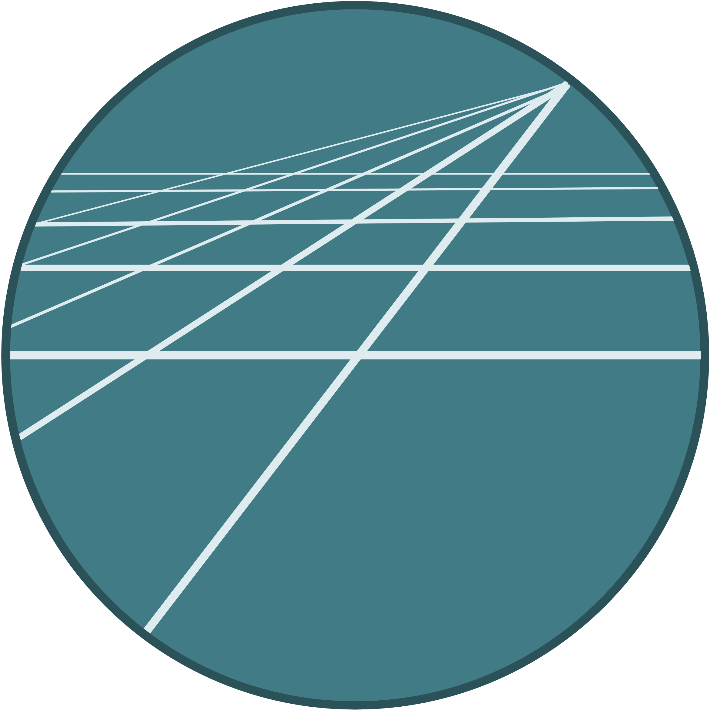

.. We'll be using the following section designations based on
   https://devguide.python.org/documenting/#sections:
   # with overline, for parts
   * with overline, for chapters
   =, for sections
   -, for subsections
   ^, for subsubsections
   ", for paragraphs

######################
GridPath Documentation
######################

**Table of Contents**

.. toctree::
   :numbered: 3
   :maxdepth: 2

   introduction
   installation
   usage
   database
   functionality
   data_toolkit
   visualization
   ui
   architecture
   advanced_docs
