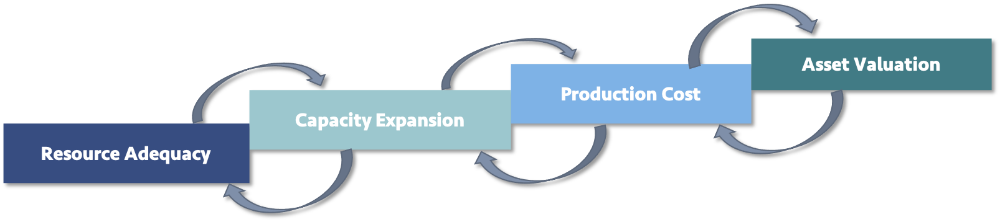

*****************
Intro to GridPath
*****************

GridPath is a versatile grid-analytics platform that seamlessly integrates
several power-system planning approaches -- including production-cost,
capacity-expansion, asset-valuation, and reliability modeling -- within the
same software ecosystem. As multiple approaches are often used sequentially or
iteratively in system planning, the seamless interface among them within the
same modeling platform reduces the labor-intensive data-translation
requirements and can speed up insight-generation in the planning process.

Architecture
============

GridPath is built for today’s and tomorrow’s world, and can be easily adapted
and extended:
it has a highly
flexible, modular architecture that facilitates its application to different
systems and regions as well as the incorporation of emergent technologies
and resources with non-standard characteristics (renewables, storage, demand
response, and so on). This makes the GridPath platform well-equipped to
quickly and seamlessly add critical functionality around new technologies,
policies, or practices, in addition to full-featured traditional power system
modeling.

Our goal is to create a transparent and user-friendly platform that
facilitates quick model development and rapid adaptation. GridPath includes database-building tools, a results-visualization suite, and
extensive validation and testing suites.

Functionality
=================

GridPath's modular architecture makes it possible to combine modules to
create optimization problems with varying features and levels of complexity.
Linear, mixed-integer, and non-linear formulations are possible
depending on the selected modules.

GridPath has a highly flexible temporal and spatial span and resolution. Each
generation, storage, and transmission asset in GridPath can be modeled
with a user-specified level of detail. The decision for what to simplify and
what requires a detailed treatment is left up to the user and can vary
depending on the application of interest. GridPath’s flexibility and
modularity facilitates its application to different systems and regions as
well as to different planning questions.

GridPath can simulate the operations of the power system, capturing the
capabilities of and constraints on generation, storage, and transmission
resources to understand grid integration and flexibility needs. In
capacity-expansion mode, GridPath can also identify cost-effective
deployment of conventional and renewable generation as well as storage,
transmission, and demand response. In asset-valuation mode, GridPath can
determine the market performance of an asset or a set of assets.

The platform can optionally capture the effects on operations and the
optimal resource portfolio of forecast error, provision of ancillary
grid services, interconnection, reliability requirements such as a planning
reserve margin or local capacity requirements, and policies such as a
renewables portfolio standard (RPS) or a carbon cap.

The main variables fall into several categories:

#. **Capacity**: whether (generator, storage, and/or transmission) capacity should be built or retired?
#. **Availability**: when capacity can be made unavailable, e.g. for planned maintenance?
#. **Operations**: how should available (generator, storage, and/or transmission) capacity be operated?

The main constraints include:

#. **Capacity**: limits on the amount of capacity that can be deployed.
#. **Availability**: requirements for unavailable time, e.g. for maintenance.
#. **Operations**: limits on the operational capabilities of generation, storage, and transmission assets.
#. **System**: meeting load, operating reserves, and reliability requirements.
#. **Policy**: meeting policy targets such as an RPS or a carbon cap.

The objective function is typically to maximize system net present value, but
other formulations are possible.

GridPath is under active development and we are continuously adding new
functionality.
