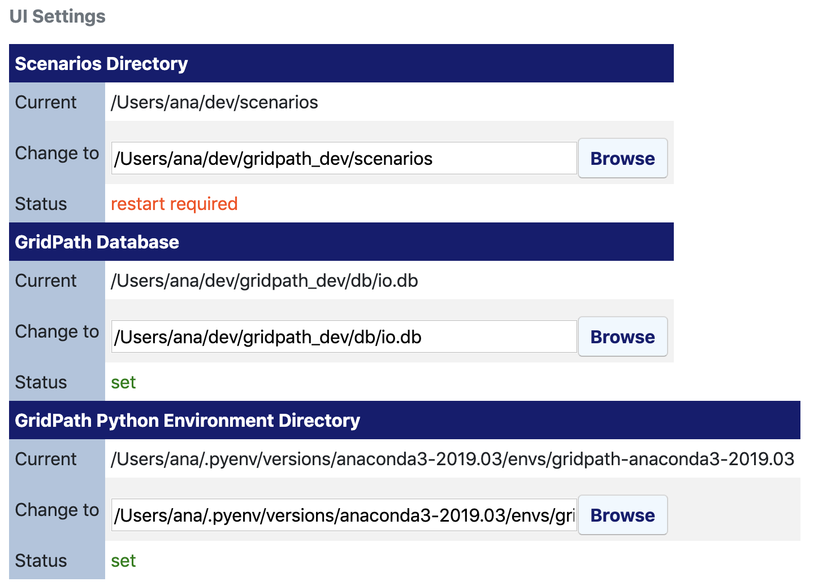
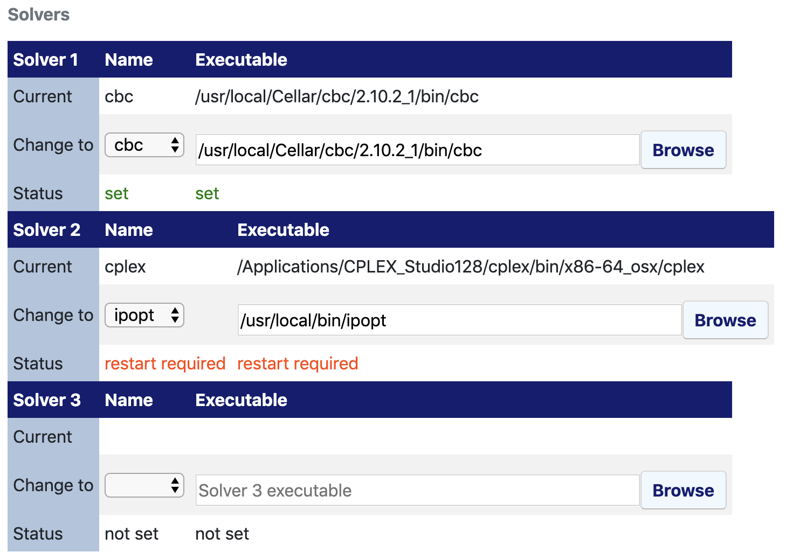
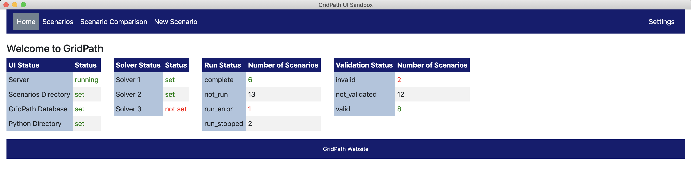

#######################
GridPath User Interface
#######################

The GridPath user interface (UI) makes it possible to interact with the
platform without relying on the command line. We will be distributing compiled
versions of the UI for Windows and Mac. You can also build the UI from
source (instructions are in the :code:`README.md` file in GridPath's
:code:`ui` package). Here we provide instructions for how to *use* the UI.

**********
Navigation
**********

The GridPath UI has a navigation bar at the top with five different screens
- :code:`Home`, :code:`Scenarios`, :code:`Scenarios Comparison`, :code:`New
Scenario`, and :code:`Settings`. The screen you are currently viewing will
be highlighted. Descriptions of the functionality available on each screen
are below.

********
Settings
********

Using the UI requires that several settings be specified. To do so, open the
UI and go to the :code:`Settings` screen (top right corner of the navigation
bar). You will see two tables, one for :code:`UI Settings` and another one for
:code:`Solvers`.

In the :code:`UI Settings` table, you must specify the directory where
scenarios will be written, the GridPath database file to use, and the
directory of your GridPath Python environment. In the :code:`Solvers` table,
you must specify up to three different solvers and the location of the
solver executables that the UI can then use to solve scenarios.

.. _ui-settings-section-ref:

UI Settings
***********

Scenarios Directory
===================

The :code:`Scenarios Directory` can be any folder in your file system. To
select one click the :code:`Browse` button in the 'Change to' row of the
:code:`Scenarios Directory` table and select a folder. For the changes to
take effect, you will need to restart the UI. The 'Status' row will warn you
if this is the case (it will show 'not set' if you haven't selected a
scenarios directory yet, 'restart required' if you need to restart for the
selected directory to be recognized by the UI, or 'set' if a directory has
been selected and no further action is required.

GridPath Database
=================

The GridPath UI uses a GridPath database file to manage inputs and outputs.
This database must conform to the GridPath database schema and be
pre-populated with input data. You can then use the UI to create and run
scenarios, and to view results. You must select the database file to use in
the :code:`Settings` screen by clicking the :code:`Browse` button in the
'Change to' row of the :code:`GridPath` table and selecting the database file
to use. For any changes to take effect, you will need to restart the UI. The
'Status' row will warn you if this is the case (it will show 'not set' if
you haven't selected a database file yet, 'restart required' if you
need to restart for the selected database file to be recognize by the UI, or
'set' if a database file has been selected and no further action is required.

GridPath Python Environment Directory
=====================================

The GridPath UI uses your GridPath Python installation. Before using it, you
must install GridPath using the instructions in
:ref:`installation-section-ref`. In particular, you must point the UI to
your GridPath Python environment directory :code:`PATH/TO/PYTHON/ENV` (see
:ref:`python-virtual-env-section-ref`). To select the directory click the
:code:`Browse` button in the 'Change to' row of the :code:`Scenarios
Directory` table and select the Python environment folder. For the changes to
take effect, you will need to restart the UI. The 'Status' row will warn you
if this is the case (it will show 'not set' if you haven't selected
an environment directory yet, 'restart required' if you need to restart for the
selected directory to be recognized by the UI, or 'set' if a directory has
been selected and no further action is required.

.. Note:: The GridPath UI server will not work until the Python environment
    directory has been selected and the UI restarted.

.. _solver-settings-section-ref:

Solvers
*******
You must tell the GridPath UI where the executables are located for solvers
that you want to use to solve scenarios. You can have the UI use up to three
different solvers at a time. Select a solver name from the drop-down menu in
the 'Change to' row for one of the three solvers and then find the
executable for that solver using the :code:`Browse` button in the respective
row. The 'Status' row will warn you if a restart is required for either the
solver name or executable value to take effect.

****
Home
****

The GridPath :code:`Home` screen provides an overview of UI settings status
and the scenario status via four different tables.

The :code:`UI Status` table provides information about whether the UI server
is running and whether the scenarios directory, GridPath database, and
GridPath Python environment directory have been set (see
:ref:`ui-settings-section-ref`).

The :code:`Solver Status` table provides information about whether the user
has selected solvers and their respective executables (see
:ref:`solver-settings-section-ref`).

The :code:`Run Status` table provides information about whether the user's
GridPath's scenarios have been run and are complete, and if any have
encountered errors.

The :code:`Validation Status` table provides information about whether the
user's GridPath's scenarios have been validated, and, if so, whether any
have been found to be invalid.

*********
Scenarios
*********

The GridPath :code:`Scenarios` screen provides a list of all scenarios the
user has created along with their status (validation status and run status)
and options to navigate to viewing detailed scenario information via the
:code:`View Detail` button and, if the scenario is complete, to viewing the
scenario results via the :code:`View Results` button. The :code:`View
Results` button is available only if the scenario 'Run Status' is 'complete.'
The information in the status columns is color-coded depending on the value.
You can navigate to the :code:`New Scenario` screen by clicking on the
:code:`New Scenario` button at the top of the scenarios list (in additon to
via the navigation bar).

Scenario Detail
***************

The :code:`Scenario Detail` screen is a gateway to more detailed information
about a scenario, including its setup, inputs, status, and results. At the top
of this screen, you can find buttons for deleting a scenario or editing its
setup (i.e. its features and subscenario selections).

The :code:`Scenario Status` table shows the validation and run status for
the scenario. The table includes columns for the current status and for the
associated action and status detail, i.e. the action to take and detail to
view vary depending on the current status.

Below the :code:`Scenario Status` table are various tables that include
information about the scenario setup including its features and subscenarios
(grouped by theme/feature) as well as the solver settings to use to run the
scenario.

Deleting a Scenario
===================

Deleting the scenario will currently remove it from the scenarios list and
clear all results associated with it in the database; it does not currently
delete the scenario directory on disk (but that's likely what we will do in
the future).

Editing a Scenario
==================

Editing the scenario allows the user to change its setup but not its name.
Note that editing an existing scenario will remove prior results from the
database (but not yet from disk). On the wishlist to implement ASAP is the
ability to edit the scenario name and description (without having to delete
prior results). We will likely do that via a separate button next to the
scenario name/description.

Validating a Scenario
=====================

GridPath includes functionality to test the validity of a scenario's setup
and inputs. Click the :code:`Validate Scenario` button in the
:code:`Validation Status` row of the :code:`Scenario Status` table to
validate or re-validate the scenario. If errors are found, you will be able
to click on a :code:`View Errors` button in the :code:`Detail` column to see
a table with the validation errors.

Running a Scenario
==================
If a scenario is not yet 'complete,' you will be able to run it by clicking the
:code:`Run Scenario` button in the :code:`Run Status` row of the
:code:`Scenario Status` table. The scenario status should then change to
'launching' and then 'running.' Once the scenario is running, you will be
able to stop the run via the :code:`Stop Run` button in the :code:`Action`
column and to view the scenario log via the :code:`View Log` button in the
:code:`Detail` column.

Viewing Scenario Results
========================
If the scenario status in the :code:`Scenario Status` is 'complete,' you
will be able to click on a :code:`View Results` button in the :code:`Detail`
column to switch to the scenario results screen. See
:ref:`ui-scenario-results-section-ref`.

Clearing a Scenario
===================

Viewing Scenario Setup and Inputs
=================================
The :code:`Features` table below the :code:`Scenario Status` table contains
information about which GridPath features are requested by the scenario. The
various tables below (e.g. :code:`Temporal Settings`, :code:`Load Zone
Settings`, :code:`System Load`, :code:`Generation and Storage Capacity`, and
so on, contain information about the data inputs used by the scenario. Each
row of these tables has the name of the subscenario used in the
:code:`Value` column. You can see the description of the subscenario and the
underlying data by clicking on the row's :code:`View Description` and `View
Inputs` buttons respectively.

.. _ui-scenario-results-section-ref:

Scenario Results
****************

The :code:`Scenario Results` view can be accessed if a scenario is
'complete' by clicking on the :code:`View Results` button in either the
:code:`Scenarios` screen or the :code:`Scenario Detail` screen.

This view includes a row for results tables and a row for results plots that
can be viewed in the UI.

.. note:: You can change which tables and plots are available in the UI by
    changing the value in the :code:`include` column of the
    :code:`ui_scenario_results_table_metadata` and
    :code:`ui_scenario_results_plot_metadata` in the database respectively.
    Additional tables and plots can be added by populating these tables.

You can click on the :code:`Show Table` or :code:`Show Plot` buttons to view
the table or plot, and on the :code:`Download Data` button to download the
underlying data to a CSV file. For the plots, you will usually also use the
dropdown menus to slice out a particular set of data (e.g. the new capacity
built in a certain zone or the operations for a particular generator in a
particular period and/or stage).

You can add any number of plots. Clear them with the Clear Plots button
Plots interactivity
You can double-click on the legend to hide it
Ymax

********************
Scenarios Comparison
********************

Scenario Selection
******************

Comparing Scenario Inputs
*************************

Comparing Scenario Results
**************************

Plots interactivity
You can double-click on the legend to hide it

************
New Scenario
************

New scenario names cannot have white spaces
