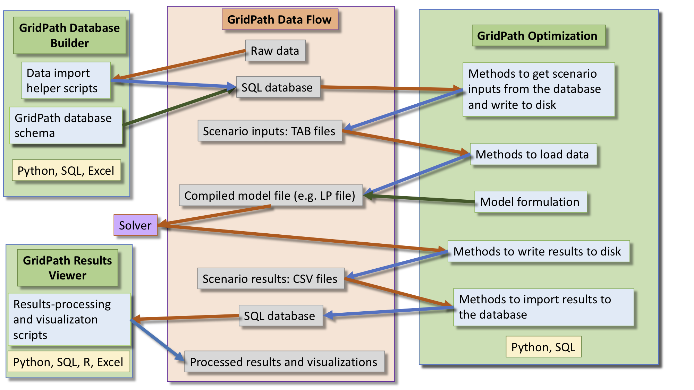

**************
Using GridPath
**************

Workflow
========

GridPath input and scenario data are managed via an SQLite database. GridPath
includes utilities to assist the user with importing raw data into the correct
database tables and data format. With the inputs loaded, the user can then
create scenarios by selecting subsets of the data (e.g. selecting a
particular load profile or a different portoflio of generators). In
GridPath's database, these subsets of data are called subscenarios. A
scenario generally consists of a list of subscenarios and GridPath includes
utilities to select the correct data for each scenario. The user also selects
desired features, which tells GridPath which database tables to look at.

See the :ref:`building-the-database-section-ref` section for more details on
how to set up and load inputs into the database, and create scenarios.

Scenario input files are written to disk in TAB files. The next step is for
the Python model (consisting of various modules that create the model
formulation) to read in the TAB-delimited input files and
create the optimization problem. The compiled model file is then sent to the
solver. GridPath is solver-agnostic and supports a wide range of solvers.

See the :ref:`running-gridpath-scenarios-section-ref` section below for how
to run a GridPath scenario.

Once the solver finds a solution, it returns the results to GridPath.
GridPath's modules then write CSV results files to disk. The user can select
to manually or automatically import these results into the database.

Finally, GridPath includes functionality to process the results and creates
various visualizations. See the :ref:`visualization-section-ref` section for
more details.

.. _running-gridpath-scenarios-section-ref:
Running GridPath Scenarios
==========================

The gridpath_run_e2e and gridpath_run commands
----------------------------------------------

Once you have loaded inputs into the database and created a scenario,
you can use the command :code:`gridpath_run_e2e` to run a scenario from any
directory -- as long as your GridPath Python environment is enabled -- as
follows::

    gridpath_run_e2e --database /PATH/TO/DATABASE --scenario SCENARIO_NAME
    --scenario_location /PATH/TO/SCENARIO

The above command runs GridPath end-to-end, i.e. gets inputs for the scenario
from the database, solves the scenario problem, imports the results into the
database, and processes them.

If you are not using the database (not recommended), you can use
the command :code:`gridpath_run` to point to a scenario for which input .tab files have
already been written::

    gridpath_run --scenario SCENARIO_NAME --scenario_location /PATH/TO/SCENARIO

To see usage and other optional arguments, e.g. how to specify a
solver, check the help menu, e.g.::

    gridpath_run_e2e --help
